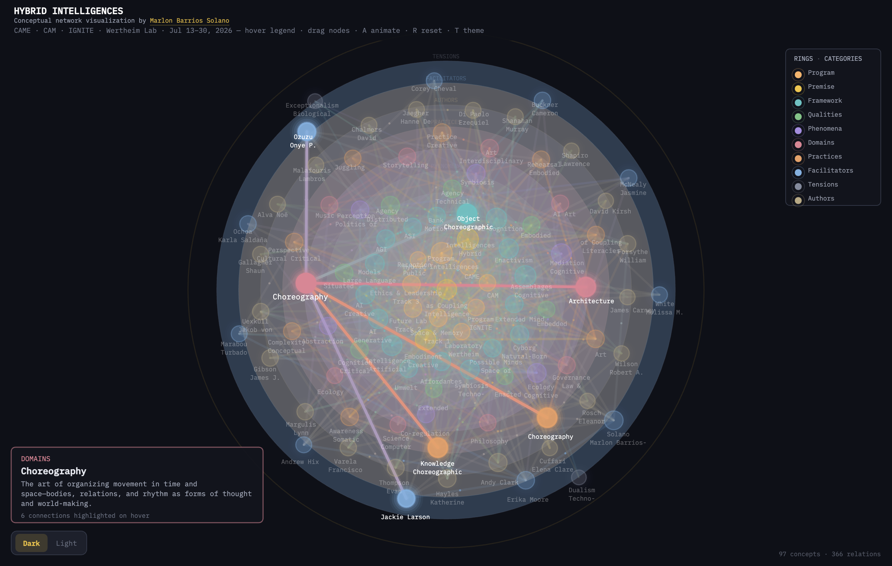

# Hybrid Intelligences

**Conceptual network visualization** by [Marlon Barrios Solano](https://marlonbarrios.github.io/)

Interactive map for **Hybrid Intelligences: Embodied Leadership and Creativity in the Era of AI** — a modular interdisciplinary program at the University of Florida, July 13–30, 2026.

**University of Florida · Center for Arts, Migration + Entrepreneurship · IGNITE Engineering · Center for Arts in Medicine · College of the Arts**

**[Open network visualization →](index.html)** · **[Browse ontology →](ontology.html)**



---

## What this is

This repository holds two linked views of the same knowledge graph:

1. **Network visualization** (`index.html`) — a radial, physics-based map of ~**192 concepts** connected by ~**1,987 weighted relations**. Concepts sit on concentric rings by category; edges show conceptual proximity, influence, and program structure.
2. **Ontology browser** (`ontology.html`) — a searchable, collapsible browse interface over the same data, exported as standard **[JSON-LD](ontology.jsonld)** and **[Turtle](ontology.ttl)** (SKOS + custom `hi:` vocabulary).

The network is both a **pedagogical instrument** for the Hybrid Intelligences program and a **formal vocabulary** for intelligence, embodiment, AI, and creative practice as *coupling* across bodies, tools, institutions, and worlds.

---

## Conceptual framework

### Core premise

The graph is organized around a single starting claim:

> **Intelligence is not located in a skull or machine—it is a relational event happening through bodies, tools, architectures, and co-presence.**

From this premise follow three anchor concepts:

| Concept | Role |
|---------|------|
| **Intelligence as Coupling** | Cognition as enacted relation, not inner substance |
| **Hybrid Intelligences** | Assemblages of biological, technical, social, spatial, legal, and affective processes that co-produce meaning |
| **Creative Embodiment** | AI-mediated creative process is already embodied, situated, and relational—the artist designs *conditions of encounter*; prompt, model, interface, dataset, institution, and audience form a **cognitive assemblage** |

Supporting premise nodes include **Intelligence**, **Embodiment**, **Body**, and **Hybrid** (mixing across substrates and ecologies).

### Cognitive assemblages

Drawing on Katherine Hayles, Andy Clark, 4E/enactivist traditions, and contemporary AI critique, the network treats cognition as **distributed**—spanning brains, bodies, tools, datasets, interfaces, institutions, and publics. Framework nodes include:

- **4E Cognition**, **Enactivism**, **Extended Mind**, **Natural-Born Cyborg**
- **Cognitive Assemblages**, **Techno-symbiosis**, **Holobiont**, **Affordances**, **Umwelt**
- **Active Inference**, **Machine Learning**, **Neural Networks**, and related AI architectures
- **Cyberfeminism**, **Queer Theory**, **Buddhism**, decolonial and critical frameworks
- Authors and artists linked to these ideas (Merleau-Ponty, Hayles, Clark, Haraway, Latour, Nāgārjuna, Mendieta, Bowery, and many others)

### Tensions held open

The **Tensions** ring names inadequate or contested positions the network refuses to treat as settled:

- Techno-dualism, biological exceptionalism, humanism, anthropocentrism
- Essentialism, universalism — and the contested horizon of **posthumanism**

These are not errors to dismiss quickly; they are **live problems** that structure design, ethics, and pedagogy in the era of AI.

### Qualities, phenomena, domains, practices

| Ring | What it holds |
|------|----------------|
| **Qualities** | Traits of hybrid cognition—embodied, situated, distributed, critical, speculative… |
| **Phenomena** | Observable dynamics—mediation, symbiosis, community, theory of mind… |
| **Domains** | Fields of inquiry and practice—choreography, law, ecology, architecture, medicine, AI… |
| **Practices** | Methods and habits—rehearsal, somatics, pedagogy, cultural critique, literacies of coupling… |

### Program layer

The inner **Program** ring anchors the July 2026 intensive:

- **Hybrid Intelligences Program** — co-led by Marlon Barrios Solano and Erika Moore (CAME + CAM, partnership with IGNITE at Wertheim Laboratory)
- **Three tracks:** Space & Memory (Mondays) · Future Lab (Wednesdays) · Ethics & Leadership (Thursdays)
- Host institutions, facilitators, guest leaders, and public reception (July 30)

---

## Ring categories

Concepts are assigned to one of ten rings, from program core outward to authors/artists:

| Order | Category | Definition |
|-------|----------|------------|
| 1 | **Program** | Sessions, tracks, hosts, and public events of the Hybrid Intelligences program |
| 2 | **Premise** | Core starting ideas—intelligence as coupling across bodies, tools, and worlds |
| 3 | **Facilitators** | Session leaders and guest facilitators |
| 4 | **Practices** | Methods and habits—rehearsal, somatics, pedagogy, cultural critique |
| 5 | **Tensions** | Inadequate or contested positions the network holds open to critique |
| 6 | **Qualities** | Traits of hybrid cognition—embodied, situated, distributed, critical |
| 7 | **Phenomena** | Observable dynamics—mediation, symbiosis, community, theory of mind |
| 8 | **Domains** | Fields of practice and inquiry—art, law, ecology, AI, choreography |
| 9 | **Framework** | Conceptual models for cognition, AI, embodiment, and world-making |
| 10 | **Authors/Artists** | Thinkers, artists, and researchers linked to concepts in the network |

Each category has a distinct color (shared across dark and light themes). Ring order reflects pedagogical layering: from *what the program is*, through *starting claims*, to *people and ideas* at the outer edge.

---

## Network visualization

### Layout and physics

- Nodes are placed on **concentric rings** proportional to category (`CATEGORY_META.ring`).
- **Soft physics:** nodes drift with subtle floating motion, repel on overlap, and spring back toward their ring when dragged and released.
- **Weighted edges** encode relation strength; stroke width and glow respond to selection, hover, and category focus.
- **Dark / light themes** with a crossfade step in the animation tour.

### Interaction

| Input | Action |
|-------|--------|
| **Hover legend category** | Preview focus—dims other rings and highlights matching nodes/edges |
| **Click legend category** | Pin category filter; click again to clear; **Esc** clears pinned focus |
| **Hover node** | Highlight node, neighbors, and connecting edges; pauses animation tour while hovered |
| **Click node** | Open detail panel (description + outbound links) |
| **Drag node** | Reposition temporarily; release to spring back |
| **A** | Start/stop **animate tour** — cycles rings → each category → theme crossfade (5 s hold per step) |
| **R** | Reset layout and clear selection |
| **T** | Toggle dark / light theme |

During animation, each ring/category step plays a **generative ambient tone** (Web Audio API). Hovering a node or pinning a category pauses the tour until you move away or clear focus.

### Deep links

| URL pattern | Effect |
|-------------|--------|
| `index.html#coupling` | Select concept node by id |
| `index.html#cat/premise` | Pin **Premise** category in the network |
| `ontology.html#coupling` | Open concept detail in ontology browser |
| `ontology.html#cat/premise` | Filter ontology to **Premise** category |

Links between network and ontology are wired from concept detail panels and category banners (“View in network ↗”).

---

## Ontology

### What is an ontology?

An **ontology** is a structured map of concepts and the relations between them—a shared vocabulary with definitions that both people and software can read. This project exports the network into **SKOS** (Simple Knowledge Organization System) with a small extension vocabulary (`hi:`) for network-specific fields (category, weight, edge strength, ring order).

### Building the ontology

Source of truth for all concepts and edges is **`hybrid-network.js`**. After editing nodes or edges, regenerate exports:

```bash
node build-ontology.js
```

This writes `ontology.jsonld` and `ontology.ttl`. The ontology browser loads JSON-LD at runtime.

### Ontology browser features

- Collapsible **category groups** in the sidebar (collapsed by default)
- Full-text **search** across labels and definitions
- **Concept detail** with related concepts, category, and link to network node
- **Category banners** with definitions and network deep links
- Dark / light theme toggle
- Download links for JSON-LD and Turtle

---

## Local development

Serve the folder over HTTP (required for ontology JSON fetch and hash routing):

```bash
git clone https://github.com/marlonbarrios/hybrid_intelligences_viz.git
cd hybrid_intelligences_viz
python3 -m http.server 8000
```

Open [http://localhost:8000/](http://localhost:8000/)

Or use the **Live Server** extension in VS Code / Cursor on `index.html`.

To update the ontology after editing `hybrid-network.js`:

```bash
node build-ontology.js
```

---

## Files

| File | Role |
|------|------|
| `index.html` | Network page shell, fonts, theme background |
| `hybrid-network.js` | Nodes, edges, categories, layout, draw loop, interaction, animation |
| `ontology.html` | Ontology browser UI (loads `ontology.jsonld`) |
| `build-ontology.js` | Export script: `hybrid-network.js` → JSON-LD + Turtle |
| `ontology.jsonld` | JSON-LD concept scheme (generated) |
| `ontology.ttl` | Turtle RDF export (generated) |
| `hybrid-network-screenshot.png` | README preview image |

---

## Credits

- **Conceptual network & ontology:** [Marlon Barrios Solano](https://marlonbarrios.github.io/)
- **Program co-director:** Erika Moore
- **Hosts:** Center for Arts, Migration + Entrepreneurship (CAME) · Center for Arts in Medicine (CAM) · IGNITE Engineering · College of the Arts, University of Florida
- **Venue:** Herbert Wertheim Laboratory for Engineering Excellence
- **Built with:** [p5.js](https://p5js.org/) · SKOS / JSON-LD / Turtle

---

## License

MIT License

Copyright (c) 2024 Marlon Barrios Solano

Permission is hereby granted, free of charge, to any person obtaining a copy
of this software and associated documentation files (the "Software"), to deal
in the Software without restriction, including without limitation the rights
to use, copy, modify, merge, publish, distribute, sublicense, and/or sell
copies of the Software, and to permit persons to whom the Software is
furnished to do so, subject to the following conditions:

The above copyright notice and this permission notice shall be included in all
copies or substantial portions of the Software.

THE SOFTWARE IS PROVIDED "AS IS", WITHOUT WARRANTY OF ANY KIND, EXPRESS OR
IMPLIED, INCLUDING BUT NOT LIMITED TO THE WARRANTIES OF MERCHANTABILITY,
FITNESS FOR A PARTICULAR PURPOSE AND NONINFRINGEMENT. IN NO EVENT SHALL THE
AUTHORS OR COPYRIGHT HOLDERS BE LIABLE FOR ANY CLAIM, DAMAGES OR OTHER
LIABILITY, WHETHER IN AN ACTION OF CONTRACT, TORT OR OTHERWISE, ARISING FROM,
OUT OF OR IN CONNECTION WITH THE SOFTWARE OR THE USE OR OTHER DEALINGS IN THE
SOFTWARE.
