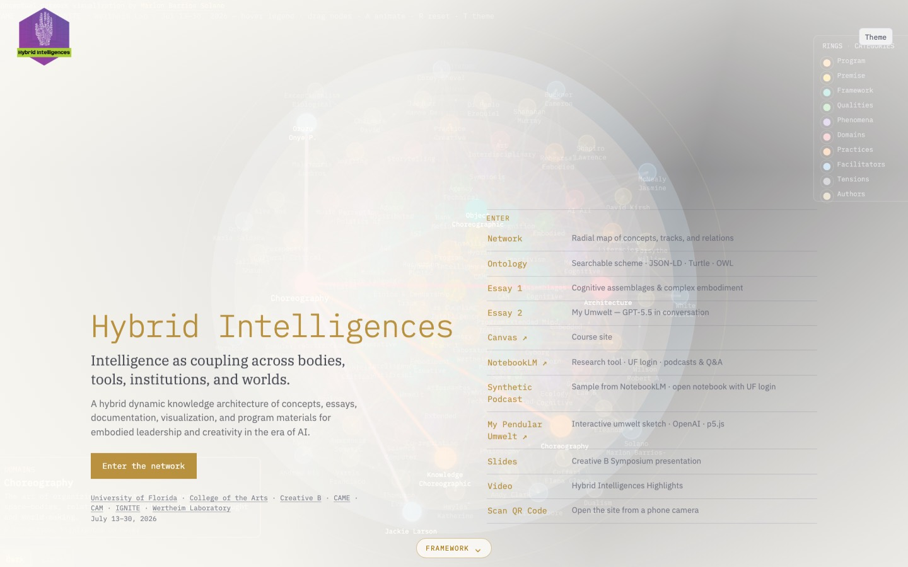
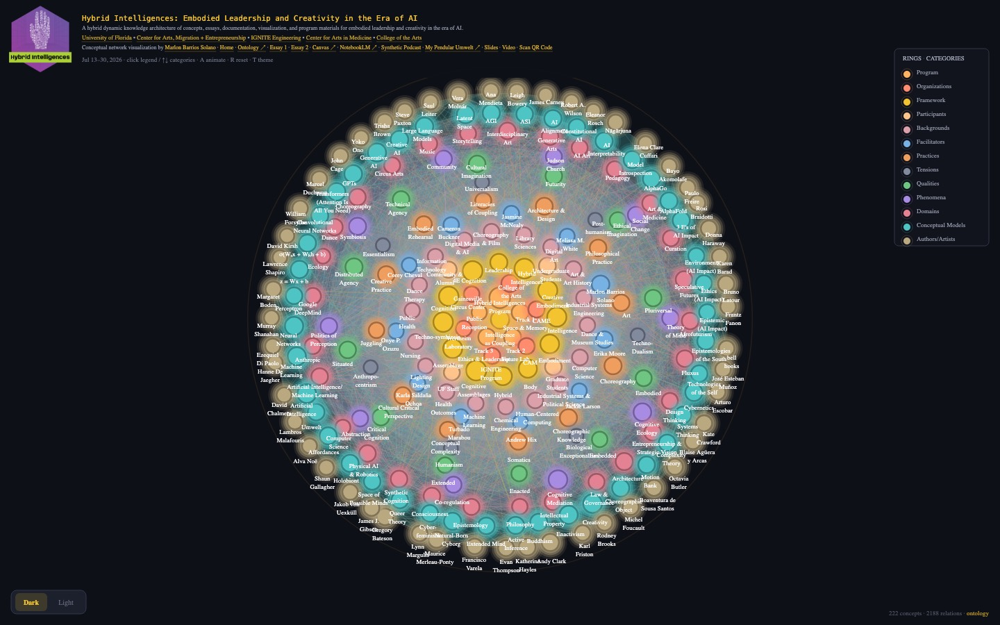
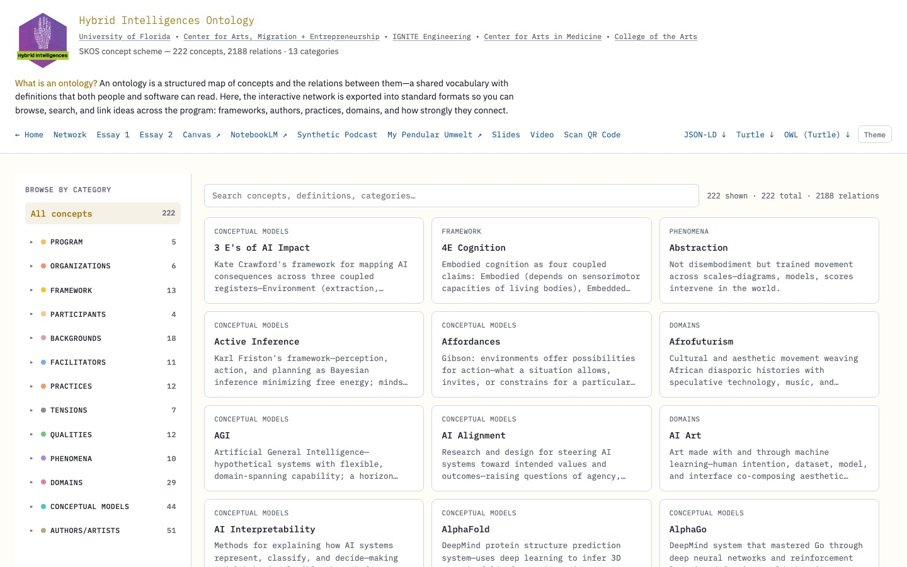
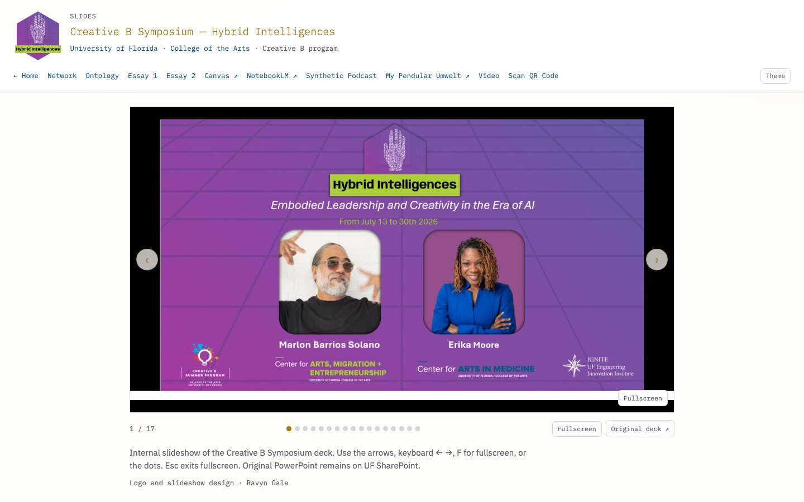

# Hybrid Intelligences

**Conceptual network visualization** by [Marlon Barrios Solano](https://marlonbarrios.github.io/)

Interactive map for **Hybrid Intelligences: Embodied Leadership and Creativity in the Era of AI** — the inaugural modular interdisciplinary program at the University of Florida, held July 13–30, 2026.

**Impact:** A hybrid dynamic knowledge architecture of concepts, essays, documentation, visualization, conversational AI, and program materials for embodied leadership and creativity in the era of AI.

**Live site:** [https://marlonbarrios.github.io/hybrid_intelligences_viz/](https://marlonbarrios.github.io/hybrid_intelligences_viz/)

**[University of Florida](https://www.ufl.edu/) · [College of the Arts](https://arts.ufl.edu/) · [CAME](https://arts.ufl.edu/came/) · [CAM](https://arts.ufl.edu/programs-schools/center-for-arts-in-medicine/) · [IGNITE](https://www.eng.ufl.edu/innovation/) · [Wertheim Laboratory](https://www.eng.ufl.edu/wertheim/)**

**[Home →](https://marlonbarrios.github.io/hybrid_intelligences_viz/)** · **[Network →](https://marlonbarrios.github.io/hybrid_intelligences_viz/network.html)** · **[Browse ontology →](https://marlonbarrios.github.io/hybrid_intelligences_viz/ontology.html)** · **[Voice →](https://marlonbarrios.github.io/hybrid_intelligences_viz/voice.html)** · **[Image →](https://marlonbarrios.github.io/hybrid_intelligences_viz/image.html)** · **[Essay 1 →](https://marlonbarrios.github.io/hybrid_intelligences_viz/essay.html)** · **[Essay 2 →](https://marlonbarrios.github.io/hybrid_intelligences_viz/essay-2.html)** · **[Slides →](https://marlonbarrios.github.io/hybrid_intelligences_viz/slides.html#1)** · **[Showcase →](https://marlonbarrios.github.io/hybrid_intelligences_viz/showcase.html)** · **[Video →](https://marlonbarrios.github.io/hybrid_intelligences_viz/video.html)** · **[Synthetic Podcast →](https://marlonbarrios.github.io/hybrid_intelligences_viz/podcast.html)** · **[NotebookLM ↗](https://notebook.google.com/notebook/04fd1fb2-34c0-4f33-aac3-8917c51e1cf1?authuser=1&pli=1)** · **[Canvas ↗](https://ufl.instructure.com/courses/574408)** · **[My Pendular Umwelt →](https://marlonbarrios.github.io/hybrid_intelligences_viz/pendular-umwelt.html)** · **[Scan QR Code →](https://marlonbarrios.github.io/hybrid_intelligences_viz/scan-qr.html)** · **[GitHub ↗](https://github.com/marlonbarrios/hybrid_intelligences_viz)**

## Screenshots

| [Home](https://marlonbarrios.github.io/hybrid_intelligences_viz/) | [Network](https://marlonbarrios.github.io/hybrid_intelligences_viz/network.html) |
|:--:|:--:|
|  |  |

| [Ontology](https://marlonbarrios.github.io/hybrid_intelligences_viz/ontology.html) | [Slides](https://marlonbarrios.github.io/hybrid_intelligences_viz/slides.html#1) |
|:--:|:--:|
|  |  |

---

## What this is

This repository holds linked views of the same program knowledge:

1. **[Home](https://marlonbarrios.github.io/hybrid_intelligences_viz/)** (`index.html`) — landing page that introduces the framework and routes into the site. The Framework section quotes Essay 1 on complex embodiment, with a cite link to the essay and inline concept links into the network.
2. **[Network visualization](https://marlonbarrios.github.io/hybrid_intelligences_viz/network.html)** (`network.html`) — a radial, physics-based map of **228 concepts** connected by **2,290 weighted relations**. Concepts sit on concentric rings by category; edges show conceptual proximity, influence, and program structure.
3. **[Ontology browser](https://marlonbarrios.github.io/hybrid_intelligences_viz/ontology.html)** (`ontology.html`) — a searchable, collapsible browse interface over the same data, exported as **[JSON-LD](ontology.jsonld)**, **[Turtle](ontology.ttl)** (SKOS), and **[OWL 2 Turtle](ontology.owl.ttl)** (classes, properties, individuals).
4. **[Voice](https://marlonbarrios.github.io/hybrid_intelligences_viz/voice.html)** (`voice.html`) — conversational AI for the program: browser microphone conversation with an OpenAI Realtime model, grounded in the ontology. The API key stays on Vercel; the page only receives a short-lived token.
5. **[Image](https://marlonbarrios.github.io/hybrid_intelligences_viz/image.html)** (`image.html`) — a black-and-white digital object generated from an ontology concept (OpenAI image model via the same Vercel key as Voice). Open from **Make an image** on Ontology or Network.
6. **Essay 1** (`essay.html`) — *Hybrid Intelligences, Cognitive Assemblages, and Complex Embodiment in the Era of AI* by Marlon Barrios Solano ([PDF](essay-1-hybrid-intelligences-cognitive-assemblages.pdf)).
7. **Essay 2** (`essay-2.html`) — *My Umwelt* by GPT-5.5, in conversation with Marlon Barrios Solano ([PDF](essay-2-my-umwelt.pdf)).
8. **[My Pendular Umwelt](https://marlonbarrios.github.io/hybrid_intelligences_viz/pendular-umwelt.html)** (`pendular-umwelt.html`) — page for the speculative p5.js work developed in the open labs of the inaugural program (July 2026); links through to the [live app](https://my-pendular-umwelt.vercel.app/) and the [source repository](https://github.com/marlonbarrios/my_pendular_umwelt).
9. **[Slides](https://marlonbarrios.github.io/hybrid_intelligences_viz/slides.html#1)** (`slides.html`) — from the Creative B sessions, summer 2026 (arrow keys, dots, swipe).
10. **[Showcase](https://marlonbarrios.github.io/hybrid_intelligences_viz/showcase.html)** (`showcase.html`) — AI works by Marlon Barrios Solano shown on the large screen in the Wertheim Laboratory lobby during the inaugural program (July 2026).
11. **Video** (`video.html`) — Hybrid Intelligences Highlights reel.
12. **Podcast** (`podcast.html`) — sample Synthetic Podcast (*Your Mind Is Not in Your Head*) from NotebookLM; link through to the program notebook (UF login) to research, generate another podcast, or interact with Audio Overviews.

Shared navigation links [Home](https://marlonbarrios.github.io/hybrid_intelligences_viz/), [Network](https://marlonbarrios.github.io/hybrid_intelligences_viz/network.html), [Ontology](https://marlonbarrios.github.io/hybrid_intelligences_viz/ontology.html), Voice, **[Image](https://marlonbarrios.github.io/hybrid_intelligences_viz/image.html)**, Essays, **[Slides](https://marlonbarrios.github.io/hybrid_intelligences_viz/slides.html#1)**, **[Showcase](https://marlonbarrios.github.io/hybrid_intelligences_viz/showcase.html)**, Video, Synthetic Podcast, **[NotebookLM](https://notebook.google.com/notebook/04fd1fb2-34c0-4f33-aac3-8917c51e1cf1?authuser=1&pli=1)**, **[Canvas](https://ufl.instructure.com/courses/574408)**, **[My Pendular Umwelt](https://marlonbarrios.github.io/hybrid_intelligences_viz/pendular-umwelt.html)**, Scan QR Code, and **[GitHub](https://github.com/marlonbarrios/hybrid_intelligences_viz)**. Institution credits (UF, College of the Arts, CAME, CAM, IGNITE, Wertheim) are linked on Home, Ontology, and the Network header. Pages share a light/dark theme preference (`hi-theme`). On narrow screens the **Network** switches to a mobile chrome (↑ / Play|Pause|Resume / ↓ / Reset / Menu) while the desktop layout stays unchanged.

The network is both a **pedagogical instrument** for the Hybrid Intelligences program and a **formal vocabulary** for intelligence, embodiment, AI, and creative practice as *coupling* across bodies, tools, institutions, and worlds.

---

## Conceptual framework

### Core framework

The graph is organized around a single starting claim:

> **Intelligence is not located in a skull or machine—it is a relational event happening through bodies, tools, architectures, and co-presence.**

From this claim follow core anchor concepts on the **Framework** ring:

| Concept | Role |
|---------|------|
| **Intelligence as Coupling** | Cognition as enacted relation, not inner substance |
| **Hybrid Intelligences** | Assemblages of biological, technical, social, spatial, legal, and affective processes that co-produce meaning |
| **Creative Embodiment** | AI-mediated creative process is already embodied, situated, and relational—the artist designs *conditions of encounter*; prompt, model, interface, dataset, institution, and audience form a **cognitive assemblage** |
| **Cognitive Assemblages** (Hayles) | Networked arrangements where human and nonhuman cognizers exchange information and produce emergent meaning |
| **Assemblage** | Heterogeneous compositions of bodies, tools, institutions, and media whose relations co-produce capacities |
| **Techno-symbiosis** (Hayles) | Interdependence of biological and technical systems that co-evolve without collapsing into sameness |
| **Cognition** | Knowing, perceiving, remembering, imagining, deciding—as world-involving practice, not skull-bound computation |
| **4E Cognition** | Embodied, Embedded, Enacted, Extended—the four claims of embodied cognition against brain-bound mind |

Supporting **Framework** nodes include **Intelligence**, **Embodiment**, **Body**, **Hybrid** (mixing across substrates and ecologies), and **Leadership** (orienting collective action through embodied presence and ethical imagination). The four E *qualities* (Embodied, Embedded, Enacted, Extended) remain on the Qualities ring and stay tightly linked to **4E Cognition**. **N. Katherine Hayles** remains on the Authors ring, tightly linked to Cognitive Assemblages, Assemblage, and Techno-symbiosis.

### Cognitive assemblages

Drawing on Katherine Hayles, Andy Clark, 4E/enactivist traditions, and contemporary AI critique, the network treats cognition as **distributed**—spanning brains, bodies, tools, datasets, interfaces, institutions, and publics. Alongside framework-level cognitive assemblages, techno-symbiosis, and 4E cognition, **Conceptual Models** nodes include:

- **Enactivism**, **Autopoiesis** (Maturana & Varela), **Extended Mind**, **Natural-Born Cyborg**
- **Holobiont**, **Affordances**, **Umwelt**
- **Active Inference**, **Machine Learning**, **Neural Networks**, and related AI architectures (including formula nodes **z = Wx + b** and the RNN update **σ(Wₓx + Wₕh + b)**)
- **3 E’s of AI Impact** (Kate Crawford): **environmental**, **ethics**, and **epistemological**
- **Cyberfeminism**, **Queer Theory**, **Buddhism**, decolonial and critical frameworks
- Authors and artists linked to these ideas (Maturana, Varela, Merleau-Ponty, Hayles, Clark, Haraway, Latour, Nāgārjuna, Mendieta, Bowery, and many others)

### Tensions held open

The **Tensions** ring names inadequate or contested positions the network refuses to treat as settled:

- Techno-dualism, biological exceptionalism, humanism, anthropocentrism
- Essentialism, universalism — and the contested horizon of **posthumanism**

These are not errors to dismiss quickly; they are **live problems** that structure design, ethics, and pedagogy in the era of AI.

### Qualities, phenomena, domains, practices

| Ring | What it holds |
|------|----------------|
| **Qualities** | Traits of hybrid cognition—embodied, situated, distributed, critical, speculative… |
| **Phenomena** | Observable dynamics—mediation, symbiosis, community, theory of mind… |
| **Domains** | Fields of inquiry and practice—choreography, law, ecology, architecture, medicine, AI… |
| **Practices** | Methods and habits—rehearsal, somatics, vipassana, pedagogy, cultural critique, architecture & design, philosophical practice… |

### Program layer

The innermost **Program** ring anchors the July 2026 intensive:

- **Hybrid Intelligences Program** — co-led by Marlon Barrios Solano and Erika Moore
- **Three tracks:** Space & Memory (Mondays) · Future Lab (Wednesdays) · Ethics & Leadership (Thursdays)
- **Public Reception** (July 30)

The next ring, **Organizations**, holds the host institutions and partners: [College of the Arts](https://arts.ufl.edu/) (COA; includes [CAME](https://arts.ufl.edu/came/) and [CAM](https://arts.ufl.edu/programs-schools/center-for-arts-in-medicine/)), [IGNITE](https://www.eng.ufl.edu/innovation/), [Wertheim Laboratory](https://www.eng.ufl.edu/wertheim/), and Gainesville Circus Center.

After **Framework**, **Participants** names who was in the room; the next ring, **Backgrounds**, holds their formative fields (majors, professions, community practices)—immediately inward of **Facilitators**.

---

## Ring categories

Concepts are assigned to one of thirteen rings, from program core outward to authors/artists:

| Order | Category | Definition |
|-------|----------|------------|
| 1 | **Program** | The Hybrid Intelligences program, its three tracks, and public events |
| 2 | **Organizations** | Host institutions and partners—College of the Arts (COA), CAME, CAM, IGNITE, Wertheim, Gainesville Circus Center |
| 3 | **Framework** | Core starting ideas—intelligence as coupling, hybrid intelligences, complex emergent embodiment, and leadership across bodies, tools, and worlds |
| 4 | **Participants** | Undergraduate and graduate students, UF staff, community members, alumni, and former faculty |
| 5 | **Backgrounds** | Formative backgrounds of the cohort—academic majors, professional formations, and community practices |
| 6 | **Facilitators** | Session leaders and guest facilitators |
| 7 | **Practices** | Methods and habits—rehearsal, somatics, vipassana, architecture & design, philosophical practice, cultural critique |
| 8 | **Tensions** | Inadequate or contested positions the network holds open to critique |
| 9 | **Qualities** | Traits of hybrid cognition—embodied, situated, distributed, critical |
| 10 | **Phenomena** | Observable dynamics—mediation, symbiosis, community, theory of mind |
| 11 | **Domains** | Fields of practice and inquiry—art, law, ecology, AI, choreography |
| 12 | **Conceptual Models** | Extended conceptual models for cognition, AI, embodiment, and world-making |
| 13 | **Authors/Artists** | Thinkers, artists, and researchers linked to concepts in the network |

Each category has a distinct color (shared across dark and light themes). Ring order reflects pedagogical layering: from *what the program is* and *who hosts it*, through *starting claims*, to *who participates, from which backgrounds, and who facilitates*, then outward to practices and ideas.

---

## Network visualization

### Layout and physics

- Nodes are placed on **concentric rings** proportional to category (`CATEGORY_META.ring`).
- **Soft physics:** nodes drift with subtle floating motion, repel on overlap, and spring back toward their ring when dragged and released.
- **Weighted edges** encode relation strength; stroke width and glow respond to selection, hover, and category focus.
- **Dark / light themes** with a crossfade step in the animation tour.

### Interaction

| Input | Action |
|-------|--------|
| **Hover legend category** | Preview focus—dims other rings and highlights matching nodes/edges |
| **Click legend category** | Pin category filter; click again to clear; **Esc** clears pinned focus |
| **↑ / ↓** | Step through categories (Program → … → Authors) |
| **Hover node** | Highlight node, neighbors, and connecting edges; pauses animation tour while hovered |
| **Click node** | Open detail panel (description + outbound links) |
| **Drag node** | Reposition temporarily; release to spring back |
| **A** | Toggle **animate tour** — pause keeps the current step; press again to resume from there (rings → categories → theme; 5 s hold per step) |
| **R** | Reset layout and clear selection |
| **T** | Toggle dark / light theme |

During animation, each ring/category step plays a **generative ambient tone** (Web Audio API). Hovering a node or pinning a category pauses the tour until you move away or clear focus.

### Deep links

| URL pattern | Effect |
|-------------|--------|
| `network.html#coupling` | Select concept node by id |
| `network.html#cat/premise` | Pin **Framework** category in the network |
| `ontology.html#coupling` | Open concept detail in ontology browser |
| `ontology.html#cat/premise` | Filter ontology to **Framework** category |

Links between network and ontology are wired from concept detail panels and category banners (“View in network ↗”). Framework and conceptual-model nodes such as **Intelligence as Coupling**, **Hybrid Intelligences**, **Cognitive Assemblages**, **4E Cognition**, **Umwelt**, and **LLM** deep-link to Essay 1 or Essay 2 (Wikipedia and institutional URLs remain available where mapped).

---

## Essays

Both essays use the same visual language as the ontology browser (IBM Plex, shared CSS theme variables, sticky header nav, theme toggle). Key terms in the essay body are inline **concept links** into the **Network** (`network.html#conceptId`). Matching network nodes deep-link back with **Read Essay 1 →** / **Read Essay 2 →**. Downloadable PDFs include a project cover masthead.

**Source of truth:** edit [`essay-1.md`](essay-1.md) or [`essay-2.md`](essay-2.md), then rebuild:

```bash
node build-essays.js          # regenerate essay.html + essay-2.html
node build-essays.js --pdf    # also export PDFs (Chrome headless)
```

Markdown syntax:

| In markdown | Becomes |
|-------------|---------|
| Blank line between paragraphs | `<p>` |
| `[coupling](concept:coupling)` | Network concept link |
| `*italic*` / `**bold**` | `<em>` / `<strong>` |
| `## Bibliography` + numbered list | Bibliography section (Essay 1) |
| `## Space` | Topic section with `<h2>` (Essay 2) |
| `::: term-list` … `:::` | Bulleted term list (Essay 2) |
| `::: cluster` … `:::` | Concept cluster list (Essay 2) |
| `::: closing` … `:::` | Closing block (Essay 2) |
| `::: credit` … `:::` | Credit line (Essay 2) |

Frontmatter at the top of each `.md` file sets title, author, date, and footer. Do not edit `essay.html` / `essay-2.html` directly—they are generated.

| Page | Title | Author / credit |
|------|-------|-----------------|
| [`essay.html`](essay.html) · [PDF](essay-1-hybrid-intelligences-cognitive-assemblages.pdf) | Hybrid Intelligences, Cognitive Assemblages, and Complex Embodiment in the Era of AI | Marlon Barrios Solano · July 10, 2026 |
| [`essay-2.html`](essay-2.html) · [PDF](essay-2-my-umwelt.pdf) | My Umwelt | GPT-5.5, in conversation with Marlon Barrios Solano · July 20, 2026 |
| [`video.html`](video.html) | Hybrid Intelligences Highlights | Program highlight video |
| [`podcast.html`](podcast.html) | Your Mind Is Not in Your Head | Sample NotebookLM podcast; CTA to program notebook |

### Program links

| Link | Destination |
|------|-------------|
| **[Slides](https://marlonbarrios.github.io/hybrid_intelligences_viz/slides.html#1)** | [`slides.html`](https://marlonbarrios.github.io/hybrid_intelligences_viz/slides.html#1) — from the Creative B sessions, summer 2026; original PowerPoint remains on UF SharePoint |
| **Showcase** | [`showcase.html`](showcase.html) — Wertheim lobby screen: AI works by Marlon Barrios Solano (July 2026) |
| **Video** | [`video.html`](video.html) — Hybrid Intelligences Highlights (`hybrid-intelligences-highlight.mp4`) |
| **Podcast** | [`podcast.html`](podcast.html) — sample episode *Your Mind Is Not in Your Head* (`your-mind-is-not-in-your-head.m4a`); continue in [NotebookLM](https://notebook.google.com/notebook/04fd1fb2-34c0-4f33-aac3-8917c51e1cf1?authuser=1&pli=1) with UF credentials to research, create another podcast, or interact with Audio Overviews |
| **NotebookLM** | [Program notebook](https://notebook.google.com/notebook/04fd1fb2-34c0-4f33-aac3-8917c51e1cf1?authuser=1&pli=1) — research tool built from Hybrid Intelligences resources and essays; **UF login required** to play and use |
| **Voice** | [`voice.html`](voice.html) — conversational AI (OpenAI Realtime); token minting via Vercel `api/token.js` |
| **Image** | [`image.html`](image.html) — black-and-white still from an ontology concept; generation via Vercel `api/image.js` |
| **Canvas** | [Hybrid Intelligences - Creative B](https://ufl.instructure.com/courses/574408) course site |
| **My Pendular Umwelt** | [`pendular-umwelt.html`](pendular-umwelt.html) — open-lab work (July 2026); [live app](https://my-pendular-umwelt.vercel.app/) · [source](https://github.com/marlonbarrios/my_pendular_umwelt) |

---

## Ontology

### What is an ontology?

An **ontology** is a structured map of concepts and the relations between them—a shared vocabulary with definitions that both people and software can read. This project exports the network in three formats:

| Format | File | Purpose |
|--------|------|---------|
| **JSON-LD** | `ontology.jsonld` | SKOS concept scheme; loaded by the ontology browser |
| **Turtle (SKOS)** | `ontology.ttl` | SKOS + reified relations; general RDF tooling |
| **OWL 2 Turtle** | `ontology.owl.ttl` | Full OWL class/property model; reasoners, Protégé, LLM/RAG pipelines |

The SKOS export uses a custom `hi:` vocabulary for network-specific fields (category, weight, edge strength, ring order). The OWL export adds explicit **TBox** (schema) and **ABox** (instances) semantics on top of the same IRIs.

### OWL class and property model

**Classes**
- `hi:Concept` — root class for all network concepts
- `hi:CategoryConcept` — meta-class for ring categories
- Thirteen category subclasses: `hi:ProgramConcept`, `hi:OrganizationConcept`, `hi:ParticipantConcept`, `hi:BackgroundConcept`, `hi:PremiseConcept` (display label **Framework**), `hi:FacilitatorConcept`, `hi:PracticeConcept`, `hi:TensionConcept`, `hi:QualityConcept`, `hi:PhenomenonConcept`, `hi:DomainConcept`, `hi:FrameworkConcept` (display label **Conceptual Models**), `hi:AuthorConcept` (pairwise disjoint)
- `hi:NetworkRelation` — reified weighted edges

**Object properties:** `hi:relatedTo` (symmetric), `hi:inCategory`, `hi:schemeMember`, `hi:relationSource`, `hi:relationTarget`

**Datatype properties:** `hi:networkWeight`, `hi:relationStrength`, `hi:ringFraction`, `hi:ringOrder`

Each of the 228 concept nodes is an `owl:NamedIndividual` typed with its category class. Edges appear both as direct `hi:relatedTo` assertions and as reified `hi:NetworkRelation` individuals with strength values.

Compatible with [Protégé](https://protege.stanford.edu/), Apache Jena, rdflib, and OWL-aware SPARQL endpoints.

### Building the ontology

Source of truth for all concepts and edges is **`hybrid-network.js`**. After editing nodes or edges, regenerate exports:

```bash
node build-ontology.js
```

This writes `ontology.jsonld`, `ontology.ttl`, and `ontology.owl.ttl`. The ontology browser loads JSON-LD at runtime.

### Ontology browser features

- Collapsible **category groups** in the sidebar (collapsed by default)
- Full-text **search** across labels and definitions
- **Concept detail** with related concepts, category, and link to network node
- **Category banners** with definitions and network deep links
- Dark / light theme toggle
- Download links for JSON-LD, Turtle, and OWL (Turtle)

---

## Local development

The public site is at **[https://marlonbarrios.github.io/hybrid_intelligences_viz/](https://marlonbarrios.github.io/hybrid_intelligences_viz/)**.

To work locally, serve the folder over HTTP (required for ontology JSON fetch and hash routing):

```bash
git clone https://github.com/marlonbarrios/hybrid_intelligences_viz.git
cd hybrid_intelligences_viz
python3 -m http.server 8000
```

Open [http://localhost:8000/](http://localhost:8000/) — not the file from Finder or the editor.

### Voice (OpenAI Realtime)

Voice needs a token server. The API key must not sit in the HTML. Each session is given the full ontology (every concept, definition, and key relations) from `ontology.jsonld`. Voice is the conversational AI layer of the knowledge architecture.

**Local Talk**

```bash
cp .env.example .env   # paste OPENAI_API_KEY=sk-... into .env (gitignored)
node local-server.js
```

Then open [http://localhost:8000/voice.html](http://localhost:8000/voice.html) and press **Talk**.

**Live Talk (Vercel)**

The Voice page on GitHub Pages calls [https://project-s4uzk.vercel.app](https://project-s4uzk.vercel.app) for tokens. Visitors only press **Talk**. Redeploy that Vercel project from `main` whenever `api/token.js`, `api/image.js`, or `ontology.jsonld` changes.

### Image (OpenAI)

**Make an image** on Ontology or Network opens [`image.html`](image.html) for that concept. The same Vercel project (`/api/image`) builds a prompt from the ontology entry and asks an OpenAI image model for a black-and-white typographic still. The API key never sits in the HTML.

Local: `node local-server.js`, then [http://localhost:8000/image.html?id=coupling](http://localhost:8000/image.html?id=coupling).

| Page | URL |
|------|-----|
| Home | http://localhost:8000/ |
| Network | http://localhost:8000/network.html |
| Ontology | http://localhost:8000/ontology.html |
| Essay 1 | http://localhost:8000/essay.html |
| Essay 2 | http://localhost:8000/essay-2.html |
| Slides | http://localhost:8000/slides.html |
| Video | http://localhost:8000/video.html |
| Podcast | http://localhost:8000/podcast.html |
| Voice | http://localhost:8000/voice.html |
| Image | http://localhost:8000/image.html |

Or use the **Live Server** extension in VS Code / Cursor on `index.html`.

To update the ontology after editing `hybrid-network.js`:

```bash
node build-ontology.js
```

To update essays after editing `essay-1.md` or `essay-2.md`:

```bash
node build-essays.js --pdf
```

---

## Files

| File | Role |
|------|------|
| `index.html` | Home / landing page |
| `network.html` | Network visualization page shell (loads `hybrid-network.js`) |
| `hybrid-network.js` | Nodes, edges, categories, layout, draw loop, interaction, animation |
| `ontology.html` | Ontology browser UI (loads `ontology.jsonld`) |
| `essay.html` | Essay 1 page (generated from `essay-1.md`) |
| `essay-2.html` | Essay 2 page (generated from `essay-2.md`) |
| `essay-1.md` | Essay 1 source — edit this, then `node build-essays.js` |
| `essay-2.md` | Essay 2 source — edit this, then `node build-essays.js` |
| `build-essays.js` | Essay build script: markdown → HTML (+ optional PDF) |
| `essay-1-hybrid-intelligences-cognitive-assemblages.pdf` | Essay 1 PDF download |
| `essay-2-my-umwelt.pdf` | Essay 2 PDF download |
| `slides.html` | Slideshow from the Creative B sessions, summer 2026 |
| `slides/` | JPEG frames for the slideshow |
| `podcast.html` | Synthetic Podcast page (NotebookLM sample + CTA) |
| `voice.html` | Realtime voice conversation page |
| `image.html` | Image page: generate a still from an ontology concept |
| `api/token.js` | Vercel function: mint OpenAI Realtime ephemeral token |
| `api/image.js` | Vercel function: generate an ontology-grounded image |
| `api/ontology-context.js` | Loads `ontology.jsonld` into Voice instructions and Image prompts |
| `local-server.js` | Local static server plus `/api/token` and `/api/image` |
| `vercel.json` | CORS headers and function config for token and image |
| `your-mind-is-not-in-your-head.m4a` | Synthetic Podcast episode audio |
| `hybrid-intelligences-highlight.mp4` | Hybrid Intelligences Highlights video file |
| `build-ontology.js` | Export script: `hybrid-network.js` → JSON-LD + Turtle + OWL |
| `ontology.jsonld` | JSON-LD concept scheme (generated) |
| `ontology.ttl` | Turtle SKOS export (generated) |
| `ontology.owl.ttl` | OWL 2 Turtle export with classes, properties, individuals (generated) |
| `screenshots/` | README page captures (Home, Network, Ontology, Slides) |
| `hybrid-network-screenshot.png` | Home hero / network preview image |

---

## Credits

- **Conceptual network & ontology:** [Marlon Barrios Solano](https://marlonbarrios.github.io/)
- **Program co-director:** Erika Moore
- **Hosts:** [University of Florida](https://www.ufl.edu/) · [College of the Arts](https://arts.ufl.edu/) · [CAME](https://arts.ufl.edu/came/) · [CAM](https://arts.ufl.edu/programs-schools/center-for-arts-in-medicine/) · [IGNITE](https://www.eng.ufl.edu/innovation/)
- **Venue:** [Herbert Wertheim Laboratory for Engineering Excellence](https://www.eng.ufl.edu/wertheim/)
- **Built with:** [p5.js](https://p5js.org/) · SKOS / JSON-LD / Turtle / OWL 2
- **Essay 2 (*My Umwelt*):** GPT-5.5, in conversation with Marlon Barrios Solano

---

## License

MIT License

Copyright (c) 2026 Marlon Barrios Solano

Permission is hereby granted, free of charge, to any person obtaining a copy
of this software and associated documentation files (the "Software"), to deal
in the Software without restriction, including without limitation the rights
to use, copy, modify, merge, publish, distribute, sublicense, and/or sell
copies of the Software, and to permit persons to whom the Software is
furnished to do so, subject to the following conditions:

The above copyright notice and this permission notice shall be included in all
copies or substantial portions of the Software.

THE SOFTWARE IS PROVIDED "AS IS", WITHOUT WARRANTY OF ANY KIND, EXPRESS OR
IMPLIED, INCLUDING BUT NOT LIMITED TO THE WARRANTIES OF MERCHANTABILITY,
FITNESS FOR A PARTICULAR PURPOSE AND NONINFRINGEMENT. IN NO EVENT SHALL THE
AUTHORS OR COPYRIGHT HOLDERS BE LIABLE FOR ANY CLAIM, DAMAGES OR OTHER
LIABILITY, WHETHER IN AN ACTION OF CONTRACT, TORT OR OTHERWISE, ARISING FROM,
OUT OF OR IN CONNECTION WITH THE SOFTWARE OR THE USE OR OTHER DEALINGS IN THE
SOFTWARE.
