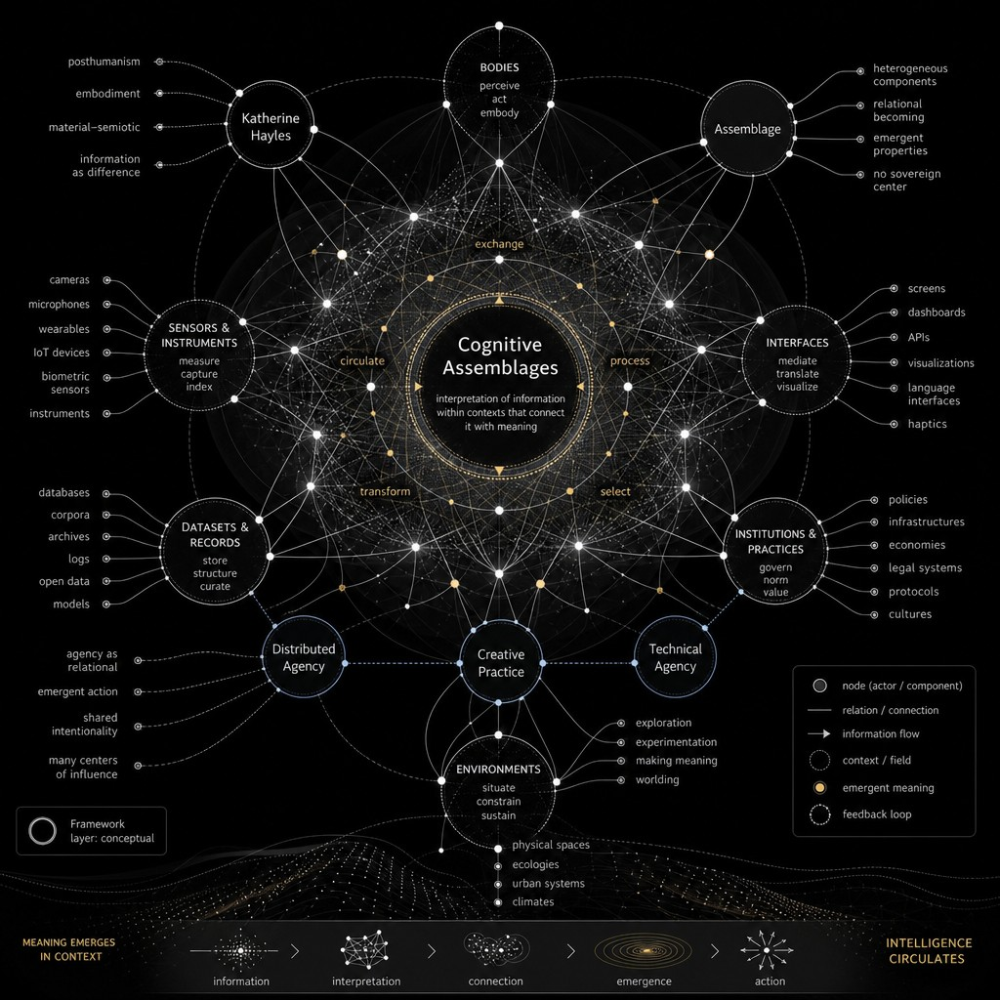

<!-- Edit this file, then run: node build-essays.js -->
<!-- Concept links: [coupling](concept:coupling) → network.html#coupling -->
<!-- Rebuild HTML + PDF: node build-essays.js --pdf -->

::: figure

Meaning emerges in context · Intelligence circulates
:::

I have long been interested in real-time processes in improvisational dance within interactive systems. That is where my work in dance and technology began, in the early 2000s, when I started building performances under the name *Unstablelandscape* in which dancers, algorithms, and audiences entered continuous feedback loops. Motion tracking, wearable sensors, and game controllers were not ornaments around choreography; they were part of the compositional intelligence of the work.

Twenty-five years later, I have the opportunity to write this essay on [hybrid intelligences](concept:hybrid) for the Hybrid Intelligences Hub. The lineages are traceable. In 2005 I published [*Designing Unstable Landscapes*](essay-4.html) in Johannes H. Birringer and Josephine Fenger’s edited volume *Tanz Im Kopf: Dance and Cognition*. That [Essay 4](essay-4.html) proposed improvisational performance with real-time multimedia as the design of a cognitive system: [coupling](concept:coupling) across bodies, interfaces, and programmed environments; cognition as [embedded, embodied, and distributed](concept:distributed) within the whole configuration rather than sealed inside any single performer or machine.

What follows is an expanded version of those concerns. The question is no longer only how dancers compose with cognitive systems on stage. The architectures themselves have grown more complex and more hybrid: [generative models](concept:gen_ai), latent recommender systems, and other nonhuman cognizers now participate in couplings I once had to program by hand. My interest has always been in cognitive process itself, in embodied knowing as what happens when one is embedded within evolving architectures, not when one pretends to stand outside them. If you have read that earlier work, you will recognize the same trajectory here.

I begin from the premise that intelligence is not a thing located inside a skull, a machine, a server, or a sovereign individual. Intelligence is an activity of [coupling](concept:coupling). It is a relational event. It happens through bodies, tools, architectures, histories, gestures, laws, media, atmospheres, and the fragile rhythms of co-presence. In the era of artificial intelligence, this premise becomes not only philosophical but urgent. We are entering a time in which mediation is no longer simply communicational, symbolic, or technical. [Mediation](concept:mediation) has become cognitive. The tools that once transmitted messages now participate in the production of perception, memory, imagination, decision, orientation, and future-making.

This is also why [embodiment](concept:embodiment) must be understood as *[complex](concept:complexity_theory)* and *emergent*, not as a simple fact of having flesh. Embodiment is complex because it is never one layer. A living body is already a nested ecology: nerves, breath, posture, affect, memory, training, injury, culture, language, tools, rooms, laws, and other bodies. It is complex because scales interfere with one another—cellular metabolism with social habit, proprioception with institutional protocol, gesture with interface, attention with architecture. No single level explains cognition. Embodiment is emergent because capacities appear from relations that none of the parts possess alone. Balance, meaning, skill, care, refusal, and imagination do not sit inside a substance waiting to be expressed; they arise through ongoing coupling. The juggler’s timing, the dancer’s listening, the writer’s rhythm with a language model, the city’s ambient intelligence through sensors and law—these are not properties of an isolated subject. They are patterns that form when bodies, worlds, and technical systems enter into mutual constraint and mutual enablement. Complex embodiment names this condition: mind as world-involving process, always more than biological presence, always more than technical mediation, always becoming through relation. 

This shift requires a vocabulary that is more complex than the opposition between human and machine. It asks us to think in terms of [hybrid intelligences](concept:hybrid): assemblages of biological, technical, social, spatial, legal, and affective processes that co-produce cognition. The question is not whether AI “thinks” like a human. The more interesting question is: what kinds of thinking become possible when humans, machines, bodies, environments, institutions, and histories enter into new forms of coupling? What kinds of subjectivities, responsibilities, choreographies, abstractions, and worlds are enacted through these couplings?

[Enactivism](concept:enactivism) and the broader framework of [4E cognition](concept:4e) offer a powerful point of departure. They are rooted in [autopoiesis](concept:autopoiesis): a living system first produces itself, then a world of significance. The four Es—embodied, embedded, enacted, and extended—challenge the classical image of cognition as internal representation processed by a brain-computer. Cognition is embodied because it depends on the sensorimotor capacities of living bodies. It is embedded because it emerges within environments that constrain and enable action. It is enacted because organisms bring forth meaningful worlds through their histories of interaction. It is extended because cognitive processes can include tools, inscriptions, devices, media, and social structures beyond the biological organism.

This lineage is also contemplative. Enactivism draws on [Buddhism](concept:buddhism)—on the analysis of experience as process rather than substance, and on the training of attention as a way of knowing rather than a prelude to knowledge. [Vipassana](concept:vipassana), the practice of insight and mindfulness, is a practice-level tool supporting that theory: a disciplined looking into sensation, arising, and passing until thought is no longer mistaken for a sovereign interior. [Francisco Varela](concept:varela)’s neurophenomenology made the coupling explicit. First-person contemplative training and third-person cognitive science are not rival methods; they are mutually necessary if cognition is to be studied as lived, embodied, and enacted. In a [cognitive assemblage](concept:assemblage), such a practice is not a retreat from mediation. It is a way of noticing how attention is already coupled—with breath, cushion, hall, tradition, nervous system, and now with screens, models, and institutions.

[Jakob von Uexküll](concept:uexkuell)’s concept of [Umwelt](concept:umwelt) sharpens this further. An Umwelt is not the objective environment as measured from nowhere. It is the lived, meaningful world of a particular organism—the selective bubble of significance enacted through that being’s sensors, effectors, rhythms, and needs. A tick’s Umwelt is not a forest in general; it is the sparse world of warmth, odor, and touch through which the tick’s life is organized. Different bodies inhabit different Umwelten even when they share the same physical space. This is why hybrid intelligence cannot be reduced to a single shared “reality” accessed by humans and machines alike. Each cognizer—biological, technical, or assembled—enacts a world of relevance. [James J. Gibson](concept:gibson)’s [affordances](concept:affordances) name the complementary side of this coupling: what an environment offers, invites, or constrains for a particular body or assemblage. A handle affords grasping for a hand of a certain scale; a prompt field affords typing, guessing, and command; a latent recommendation affords attention before deliberation arrives. Affordances are not properties of objects alone, nor inventions of mind alone. They are relational possibilities that appear within an Umwelt. To design with AI is therefore to redesign Umwelten: to alter what can be sensed, reached, refused, remembered, and made actionable—and for whom.

This framework matters profoundly for thinking about [AI](concept:ai) because it allows us to avoid two inadequate positions. The first is [techno-dualism](concept:techno_dualism): the fantasy that intelligence can be cleanly detached from bodies, histories, ecologies, and politics. The second is [biological exceptionalism](concept:bio_exception): the assumption that only organic life can participate meaningfully in cognitive processes. Between these positions lies a more complex terrain: an ecosystem of intelligences in which biological and artificial systems do not collapse into sameness, but neither remain entirely separate. They form continuities, frictions, dependencies, asymmetries, and new relational forms across different substrates.

In this sense, cognition is not only embodied; it is also [critical](concept:critical) and [situated](concept:situated). It is critical because every cognitive system participates in the production, filtering, and organization of what can be known, felt, imagined, and acted upon. Cognition is never innocent. It is shaped by infrastructures, histories, disciplines, interfaces, institutions, colonial inheritances, legal systems, economic pressures, and asymmetries of power. It is situated because thinking always happens somewhere: in a body, in a room, in a language, in a technical platform, in an archive, in a legal regime, in a choreography of access, in an economy of attention, in an ecology of other bodies and other intelligences. From an enactive and 4E perspective, cognition is not an abstract universal operation floating above the world. It is a world-involving practice. This is why hybrid intelligence must be approached not only as a technical phenomenon but as a critical, spatial, somatic, choreographic, philosophical, and political condition.

[N. Katherine Hayles](concept:hayles)’s notion of [cognitive assemblages](concept:assemblage) gives this argument another crucial vocabulary. For Hayles, cognition should not be restricted to conscious human thought. Cognition can be understood more broadly as the interpretation of information within contexts that connect it with meaning. This allows us to recognize cognitive activity across biological systems, technical systems, and mixed human-machine configurations. A cognitive assemblage is not simply a collection of parts. It is a networked arrangement in which human and nonhuman cognizers exchange, process, select, and transform information in ways that produce emergent meaning and action.

This concept is essential for thinking hybrid intelligences because it shifts the center of gravity away from the individual subject. In a cognitive assemblage, intelligence does not belong exclusively to the human user or the technical device. It circulates through the relations among bodies, sensors, interfaces, datasets, habits, institutions, and environments. A dancer using motion capture, an architect designing with generative models, a lawyer interpreting algorithmic risk, a writer composing with a language model, a city managed through traffic sensors, and a performer improvising with real-time AI are all participating in different forms of cognitive assemblage. Meaning and decision arise from the whole configuration, not from one sovereign point of origin.

Hayles’s work also helps clarify why technical agency matters. Technical systems do not need to be conscious in order to participate in cognition. A machine learning model, a recommendation system, a surveillance device, or an AI assistant may not possess lived experience, but it can still sort, infer, classify, prioritize, and act within contexts that have meaning for human and institutional worlds. This is precisely what makes AI politically and philosophically significant. Its cognition is not human cognition, but it enters into human worlds. It changes the field of possibility. It reorganizes attention, distributes agency, and participates in the conditions under which meaning is produced.

From cognitive assemblages follows another of Hayles’s decisive terms: *[techno-symbiosis](concept:technosymbiosis)*. If cognitive assemblage names the networked structure through which meaning and action emerge, techno-symbiosis names the evolutionary and ecological character of that coupling. Drawing on symbiotic biology and extending it toward technical systems—as in her argument from bacteria to AI—Hayles invites us to think human–machine relations as mutual constitution rather than mere tool use. Symbiosis does not mean harmony or equality. It means interdependence across different metabolisms: information, energy, labor, attention, infrastructure. Humans and AI systems do not become the same; they become mutually entangled. Hybrid intelligence, in this sense, is not a metaphor for mixing. It is a techno-symbiotic condition in which biological and artificial processes co-evolve within institutions, interfaces, and worlds.

The notion of the “[space of possible minds](concept:possible_minds)” is useful here. It invites us to imagine intelligence not as a single ladder with humans at the top, but as a vast landscape of possible cognitive organizations. Biological intelligence occupies only one region of this space. Human linguistic consciousness, animal navigation, fungal communication, cellular problem-solving, collective swarm behavior, machine learning systems, and human-AI assemblages may all be understood as different configurations of sensing, memory, adaptation, action, and world-making. The arrival of [generative AI](concept:gen_ai) does not simply add a new tool to culture. It makes visible that mind itself has always been distributed, scaffolded, ecological, and relational. It also extends a line of inquiry I began when I treated performers and real-time systems as co-composers in the *Unstablelandscape* works. The partner in the coupling is no longer only a motion-tracking patch or an algorithm with simple rules; it includes models whose agency, memory, and opacity exceed anything I could script in the early 2000s.

From this perspective, AI is not merely an external instrument. It becomes part of a cognitive ecology. When I write with a language model, search through a dataset, generate an image, compose code, rehearse a concept, or enter into dialogue with an artificial interlocutor, I am not outsourcing thought in a simple way. I am entering a hybrid process in which my attention, memory, language, rhythm, and imagination are reorganized. The AI does not replace my cognition; it perturbs it, extends it, accelerates it, sometimes flattens it, sometimes opens it. It becomes a cognitive prosthesis, but also a cognitive environment. It is not only a hammer in the hand. It is also weather.

[Andy Clark](concept:clark)’s work is especially important here. In *Being There*, *Natural-Born Cyborgs*, *Supersizing the Mind*, *Surfing Uncertainty*, and *The Experience Machine*, Clark develops a vision of mind as deeply entangled with body, world, tools, and predictive action. Human beings are not sealed cognitive units; we are organisms that think by incorporating notebooks, gestures, language, diagrams, smartphones, architectural cues, social routines, and now AI systems into the very fabric of thought. Clark’s idea of the “[natural-born cyborg](concept:cyborg)” does not mean that technology is foreign to the human. It means that the human has always been technologically plastic, always already open to cognitive [extension](concept:extended). In the era of AI, this insight becomes crucial: generative systems are not merely instruments we use after thought has occurred. They are becoming part of the situated environments through which thought is composed, rehearsed, externalized, contested, and transformed.

This is why [embodiment](concept:embodiment) remains central, even when dealing with apparently disembodied systems. Contemporary AI models may not have flesh, proprioception, pain, breath, hunger, or mortality, but they are not outside embodiment in a broader sense. They are embodied in infrastructures: data centers, extraction economies, labor systems, electrical grids, interfaces, datasets, laws, and patterns of use. They inhabit different substrates, but they are not immaterial. Their bodies are distributed, planetary, and often hidden. To think hybrid intelligence responsibly is to make those bodies perceptible.

[Kate Crawford](concept:crawford)’s [three E’s of AI impact](concept:three_es_ai) give this a precise map. The consequences of AI are not only computational. They are [environmental](concept:ai_impact_environment)—extraction, energy, water, carbon, and the ecologies that make models run. They are a matter of [ethics](concept:ai_impact_ethics)—labor, bias, surveillance, governance, and the distribution of harm. And they are [epistemological](concept:ai_impact_epistemic)—how classification, datasets, and models organize what can be known, remembered, and taken as real. These registers are coupled. An extractive energy regime is already an ethical and an epistemological regime. To design hybrid intelligence without them is to treat AI as weather without climate.

Here [architecture](concept:architecture) becomes a crucial field of inquiry, but not only as the design of static space. Architecture is performative: it is how worlds become knowable through what they afford. Space is not a neutral container for cognition. It is an active participant in the formation of perception, attention, movement, and behavior. Knowing is relational here. One learns a room by moving through it, by feeling what it invites, resists, accelerates, or stabilizes. A corridor invites movement differently from a plaza. A studio invites improvisation differently from a courtroom. A classroom organizes speech, authority, and attention differently from a dance floor or a meditation hall. A screen-based interface organizes the body differently from a circle of people sitting on the floor. Architecture choreographs cognition through [affordances](concept:affordances): openings, thresholds, distances, acoustics, light, texture, orientation, and the politics of access. To inhabit an architecture is already to think with it.

In hybrid intelligence, architecture expands to include digital platforms, databases, algorithmic interfaces, immersive environments, and institutional protocols. We inhabit not only rooms but cognitive architectures. A platform is an architecture of attention. A database is an architecture of memory. A prompt interface is an architecture of desire and command. A recommendation system is an architecture of anticipation. A legal form is an architecture of responsibility. The built environment and the computational environment increasingly interpenetrate, producing spaces where bodies, abstractions, images, data, and decisions co-compose each other. This performative sense of architecture connects directly to the line I traced in [Essay 4](essay-4.html) through [Steve Paxton](concept:steve_paxton) and [James J. Gibson](concept:gibson): improvisation as perception-action coupling, where the mover does not first represent the floor and then act upon it, but knows the floor by moving with it.

[Rodney Brooks](concept:brooks) offers a parallel architecture from [physical AI](concept:physical_ai) and embodied robotics. His subsumption architecture and bottom-up approach to intelligence reject the fantasy that mind must be built from a central symbolic planner before action can occur. Instead, layered reflexes, sensory coupling, and immediate response to the world produce competent behavior without detached representation. Brooks trained robots to navigate by trusting local perception and adaptive reaction rather than exhaustive world models. This materialist framework of intelligence resonates with movement improvisation: decentralized, adaptive, trusting the immediacy of cognitive processes rather than commanding them from above. [N. Katherine Hayles](concept:hayles) names much of this terrain in *Unthought*: cognition that operates below conscious deliberation, through technical and biological systems that sort, select, and act before explicit representation arrives. Brooks’s reflexive robotics and Hayles’s cognitive nonconscious describe different substrates of the same insight: intelligence often runs faster and more materially than the stories we tell about it.

[Choreography](concept:choreography), then, is not only the art of arranging bodies in space. It becomes a method for studying distributed cognition. Choreography understands that thought is temporal, relational, rhythmic, and situated. A gesture is not merely an expression of an already-formed idea; it can be the condition through which an idea becomes thinkable. Improvisation demonstrates that intelligence can happen before explicit representation. The dancer does not first plan every movement and then execute it. The dancer listens through the muscles, skin, vestibular system, breath, floor, partner, and atmosphere. The body thinks by moving. Movement improvisation has long implied a different notion of intelligence: decentralized, adaptive, and trained rather than commanded. Contact improvisation, Paxton’s work, and the Judson lineage did not treat the body as a puppet of a central executive. They cultivated responsive fluency: listening, weight-sharing, falling and recovering, trusting reflex and relation. [William Forsythe](concept:forsythe) extends this lineage through the notion of the [choreographic object](concept:choreo_object): not a substitute for the body, but an alternative site where choreographic principles persist, instigate action, and organize relation. In *Synchronous Objects for One Flat Thing, reproduced*, Forsythe and collaborators at Ohio State translated a dance from live enactment into data, visualizations, and interactive software. Choreography flowed from dance to data to objects. The project asked whether choreographic thinking could become durable and shareable across domains without reducing it to disembodied command. Such an object cannot be fully known without motion, yet its structures become legible to those who might never enter a studio. **Intelligence is held in bodies, but also in scores, alignments, cues, and the interfaces that train attention between them.** For me this is not abstraction alone. It grows from decades of improvising within designed systems, from the *Unstablelandscape* performances described in [Essay 4](essay-4.html) to the couplings I now compose with language models, datasets, and interfaces in this Hub.

This choreographic understanding is essential for AI futures. Forsythe proposed that choreography is an organizational practice relevant to many domains; *Synchronous Objects* made that claim operational by leading the dance expert out and the non-dance expert in. Hybrid intelligence extends the same intuition into generative models and cognitive architectures. If we treat AI only as a symbolic or computational system, we will design futures of disembodied command: prompts, outputs, optimization, prediction. But if we approach AI through choreography, we ask different questions. What are the rhythms of interaction? Who leads and who follows? What kinds of attention are being trained? What gestures become possible or impossible? How does the interface shape the posture of the user? What forms of dependence, improvisation, resistance, and co-creation emerge? A human-AI system is not just a workflow. It is a duet, sometimes graceful, sometimes coercive, sometimes opaque.

[Somatics](concept:somatics) adds another layer by insisting on interiority—not as a private essence sealed inside the individual, but as lived bodily awareness. Somatic practices train attention to sensation, breath, tone, weight, impulse, and the subtle transitions between activation and rest. They teach that cognition is not only problem-solving but self-regulation, attunement, and presence. [Vipassana](concept:vipassana) belongs in this field: a [Buddhist](concept:buddhism) practice of insight that trains seeing the grain of experience as it arises. It is not an ornament to enactivism. It is one of the methods through which embodied and enactive approaches learned to take first-person awareness seriously. In a world of accelerated cognitive mediation, somatics becomes a political and epistemic practice. It asks: can I feel what the system is doing to my attention? Can I sense when my body contracts around speed, persuasion, novelty, fear, or the pressure to respond? Can I notice the difference between an idea that emerges from deep listening and an idea produced by algorithmic momentum?

This is not a nostalgic return to the “natural” body. The body itself is already hybrid, historical, trained, wounded, augmented, and mediated. Somatics does not purify cognition; it thickens it. It reminds us that interiority is not opposed to relationality. My nervous system is shaped by other nervous systems. Bodies co-regulate. A room can calm or agitate. A voice can organize breath. A group can produce a shared field of attention. A technological interface can accelerate, fragment, or stabilize perception. In this sense, intelligence is not only individual capacity but relational atmosphere. Hybrid intelligence must therefore include the study of co-regulating bodies: human-human, human-machine, machine-institution, body-space, body-law.

[Law](concept:law) may seem distant from embodiment, but it is one of the most powerful architectures of action. Law choreographs what bodies may do, what systems may deploy, what risks are acceptable, what harms are recognized, and whose vulnerability counts. In the era of AI, law cannot be understood only as external regulation applied after innovation. It is part of the cognitive ecology itself. Legal frameworks shape the design of systems, the distribution of accountability, the visibility of harm, and the limits of automation. If mediation has become cognitive, then governance must also become cognitive: not in the sense of automated control, but in the sense of understanding how sociotechnical systems shape attention, agency, rights, and futures.

A hybrid intelligence framework therefore needs ethics and law, but also more than ethics and law. It needs choreography to understand movement and relation. It needs architecture to understand spatial cognition. It needs philosophy to question subjectivity, agency, abstraction, and world-making. It needs somatics to cultivate awareness of interiority and co-regulation. It needs computer science to understand technical systems. It needs ecology to understand interdependence. It needs art because speculative futures are not only predicted; they are rehearsed, staged, prototyped, felt, and contested.

Juggling offers a deceptively simple example, almost an extreme representation of this training in movement and reflex. To juggle is to train a body to inhabit a dynamic system of gravity, rhythm, anticipation, failure, and correction. The juggler does not control each ball through abstract calculation. Instead, the body learns patterns of timing, peripheral vision, release, catch, and recovery. Intelligence appears as a loop between hand, eye, object, air, and expectation. The balls are not passive objects; they participate in the cognitive system by demanding response. Gravity becomes a collaborator. Error becomes information. Skill emerges not as domination but as attunement. Juggling is embodied coordination pushed to visibility: reflex trained until it feels like second nature, much as Brooks sought reflexive competence in robots and as improvisers seek responsive fluency on the floor.

This makes juggling a model for hybrid cognition. In working with AI, we are also juggling trajectories. Prompts, outputs, memories, biases, interfaces, hallucinations, regulations, desires, and institutional pressures are constantly in motion. The task is not to master the system from outside, but to train reflexes within the coupling. We need cognitive reflexes: when to trust, when to pause, when to verify, when to ask differently, when to refuse, when to bring the body back into the loop. We need artistic reflexes: how to turn uncertainty into form, how to work with surprise, how to remain porous without becoming passive. We need ethical reflexes: how to sense asymmetry, extraction, manipulation, and harm before they harden into infrastructure. Hayles’s account of the cognitive nonconscious reminds us that many of these reflexes will operate below explicit deliberation; the design question is whether they are cultivated with care or left to default momentum.

Speculative futures in AI should therefore not be imagined only as scenarios of technological progress or catastrophe. They should be approached as embodied rehearsals. What kinds of bodies do these futures require? What kinds of spaces do they produce? What kinds of attention do they reward? What forms of relationality do they make possible? What forms of interiority do they erode? The future is not simply ahead of us. It is enacted through present practices, habits, tools, regulations, and desires. Every interface is a small rehearsal of a world.

To think hybrid intelligences through enactivism is to insist that cognition and world are co-emergent. We do not first have a world and then represent it. We bring forth worlds through action. AI systems now participate in that bringing forth. They generate images, categories, recommendations, simulations, decisions, bureaucratic classifications, aesthetic styles, legal risks, and speculative horizons. They do not merely describe reality; they help organize what can appear as real, plausible, valuable, or actionable. This is why the politics of AI is also a politics of perception.

This is also why abstraction must be reconsidered. Abstraction is often treated as a movement away from the body, away from the concrete, away from the situated. But from an embodied and enactive perspective, abstraction is not disembodiment. It is a trained operation of movement across scales. A diagram, a legal category, a choreographic score, an architectural plan, a machine learning model, and a philosophical concept are all abstractions that reorganize perception and action. They do not float above the world; they intervene in it. They shape what can be noticed, measured, designed, governed, or imagined. In hybrid intelligence, abstraction becomes spatial, procedural, and performative.

This has consequences for creative practice. The artist working with AI is not simply producing outputs. The artist is designing conditions of encounter. The prompt becomes a choreographic proposition. The model becomes a partner, archive, mirror, alien surface, and unstable collaborator. The interface becomes a studio. The dataset becomes a ghostly social body. The output becomes evidence of a negotiation between human intention, statistical memory, technical constraint, cultural residue, and speculative projection. [Creative embodiment](concept:creative_embodiment) in AI is therefore not about adding the body after the technology. It is about recognizing that the entire process is already embodied, situated, and relational, even when the body is missing from the image. I have been designing such conditions of encounter since the early 2000s; what changes in the era of generative AI is the scale, speed, and opacity of the nonhuman partner within the assemblage.

Hayles’s cognitive assemblages allow us to name this condition with precision. The artist, the model, the interface, the dataset, the institution, the audience, the law, the energy infrastructure, and the historical archive are not external contexts around the artwork. They are participants in the assemblage through which the work thinks. The work is not only an object but a distributed cognitive event. It emerges from interactions among human and technical cognizers, each with different capacities, temporalities, and modes of selection. This does not mean that all agents are equivalent. It means that agency is [distributed](concept:distributed) unevenly and must be analyzed relationally.

The challenge is to cultivate forms of hybrid intelligence that do not reduce the human to a prompt operator or the machine to a magical oracle. We need practices that preserve friction, embodiment, plurality, and accountability. We need to design systems that support not only efficiency but discernment; not only automation but awareness; not only prediction but imagination; not only scale but situated responsibility. The question is not how to become more machine-like, nor how to keep machines outside the sacred circle of human thought. The question is how to compose cognitive assemblages that expand our capacity to sense, care, imagine, and act.

In this sense, creative embodiment is not a decorative addition to AI research. It is a necessary epistemology. The body is where abstraction becomes consequential. Space is where cognition becomes situated. Movement is where thought becomes temporal. Law is where technological possibility becomes collective obligation. Somatics is where mediation becomes felt. Choreography is where relations become legible. Architecture is where worlds become inhabitable. AI is where our old assumptions about mind, agency, and mediation are forced into mutation.

Hybrid intelligence names this mutation. Cognitive assemblage names its structure. Techno-symbiosis names its ecology of interdependence. Together they describe the emergence of cognitive ecosystems in which biological and artificial processes meet without becoming identical. They ask us to develop new literacies of coupling: sensory, technical, legal, spatial, poetic, and ethical. They ask us to inhabit the space of possible minds not as conquerors, but as careful choreographers of relation. The future of AI may depend less on whether machines become like us than on whether we can become more skillful participants in the expanded ecologies of intelligence we are already creating.

## Bibliography

1. Carney, James. “Thinking avant la lettre: A Review of 4E Cognition.” *Evolutionary Studies in Imaginative Culture* / PMC, 2020.
2. Clark, Andy. *Being There: Putting Brain, Body, and World Together Again*. Cambridge, MA: MIT Press, 1997.
3. Clark, Andy. *Natural-Born Cyborgs: Minds, Technologies, and the Future of Human Intelligence*. Oxford: Oxford University Press, 2003.
4. Clark, Andy. *Supersizing the Mind: Embodiment, Action, and Cognitive Extension*. Oxford: Oxford University Press, 2008.
5. Clark, Andy. *Surfing Uncertainty: Prediction, Action, and the Embodied Mind*. Oxford: Oxford University Press, 2016.
6. Clark, Andy. *The Experience Machine: How Our Minds Predict and Shape Reality*. New York: Pantheon, 2023.
7. Clark, Andy, and David Chalmers. “The Extended Mind.” *Analysis* 58, no. 1, 1998: 7–19.
8. Crawford, Kate. *Atlas of AI: Power, Politics, and the Planetary Costs of Artificial Intelligence*. New Haven: Yale University Press, 2021.
9. Di Paolo, Ezequiel, Elena Clare Cuffari, and Hanne De Jaegher. *Linguistic Bodies: The Continuity Between Life and Language*. Cambridge, MA: MIT Press, 2018.
10. Draganski, Bogdan, Christian Gaser, Volker Busch, Gerhard Schuierer, Ulrich Bogdahn, and Arne May. “Neuroplasticity: Changes in Grey Matter Induced by Training.” *Nature* 427, 2004: 311–312.
11. Brooks, Rodney A. *Cambrian Intelligence: The Early History of the New AI*. Cambridge, MA: MIT Press, 1999.
12. Gallagher, Shaun. *How the Body Shapes the Mind*. Oxford: Oxford University Press, 2005.
13. Gibson, James J. *The Ecological Approach to Visual Perception*. Boston: Houghton Mifflin, 1979.
14. Hayles, N. Katherine. *How We Became Posthuman: Virtual Bodies in Cybernetics, Literature, and Informatics*. Chicago: University of Chicago Press, 1999.
15. Hayles, N. Katherine. “Cognitive Assemblages: Technical Agency and Human Interactions.” *Critical Inquiry* 43, no. 1, 2016: 32–55.
16. Hayles, N. Katherine. *Unthought: The Power of the Cognitive Nonconscious*. Chicago: University of Chicago Press, 2017.
17. Hayles, N. Katherine. *Bacteria to AI: Human Futures with Our Nonhuman Symbionts*. Chicago: University of Chicago Press, 2025.
18. Kirsh, David. “Thinking with the Body.” *Proceedings of the Annual Meeting of the Cognitive Science Society*, 2010.
19. Malafouris, Lambros. *How Things Shape the Mind: A Theory of Material Engagement*. Cambridge, MA: MIT Press, 2013.
20. NIST. *Artificial Intelligence Risk Management Framework (AI RMF 1.0)*. National Institute of Standards and Technology, 2023.
21. Noë, Alva. *Action in Perception*. Cambridge, MA: MIT Press, 2004.
22. Parliament of the European Union and Council of the European Union. *Artificial Intelligence Act*. Regulation (EU) 2024/1689 laying down harmonised rules on artificial intelligence, 2024.
23. Shanahan, Murray. “The Space of Possible Minds.” *Edge*, 2018.
24. Shapiro, Lawrence. “Embodied Cognition.” *Stanford Encyclopedia of Philosophy*, 2021.
25. Thompson, Evan. *Mind in Life: Biology, Phenomenology, and the Sciences of Mind*. Cambridge, MA: Harvard University Press, 2007.
26. Uexküll, Jakob von. *A Foray into the Worlds of Animals and Humans: with A Theory of Meaning*. Translated by Joseph D. O’Neil. Minneapolis: University of Minnesota Press, 2010.
27. Varela, Francisco J. “Neurophenomenology: A Methodological Remedy for the Hard Problem.” *Journal of Consciousness Studies* 3, no. 4, 1996: 330–349.
28. Varela, Francisco J., Evan Thompson, and Eleanor Rosch. *The Embodied Mind: Cognitive Science and Human Experience*. Cambridge, MA: MIT Press, 1991; revised edition, 2017.
29. Wilson, Robert A., and Andy Clark. “How to Situate Cognition: Letting Nature Take Its Course.” In *The Cambridge Handbook of Situated Cognition*, edited by Philip Robbins and Murat Aydede. Cambridge: Cambridge University Press, 2009.
30. Paxton, Steve. “Improvisation Is a Word for Something That Can’t Keep a Name.” In *Moving History/Dancing Cultures: A Dance History Reader*, edited by Ann Dils and Ann Cooper Albright. Middletown, CT: Wesleyan University Press, 2001.
31. Forsythe, William. “Choreographic Objects.” Essay on *Synchronous Objects for One Flat Thing, reproduced*. Ohio State University, 2009. https://synchronousobjects.osu.edu/media/inside.php?p=essay
32. deLahunta, Scott, and Norah Zuniga Shaw. “Choreographic Resources: Agents, Archives, Scores and Installations.” *Performance Research* 13, no. 1 (2008): 131–133.
33. Palazzi, Maria, and Norah Zuniga Shaw. “Synchronous Objects for One Flat Thing, Reproduced.” In *SIGGRAPH 2009: Art Gallery*, 2009. https://doi.org/10.1145/1597990.1597992
34. Barrios Solano, Marlon. “Designing Unstable Landscapes: Improvisational Dance within Cognitive Systems.” In *Tanz Im Kopf: Dance and Cognition*, edited by Johannes H. Birringer and Josephine Fenger. Broschiert, 2005. Republished as [Essay 4](essay-4.html) in the Hybrid Intelligences Hub.
