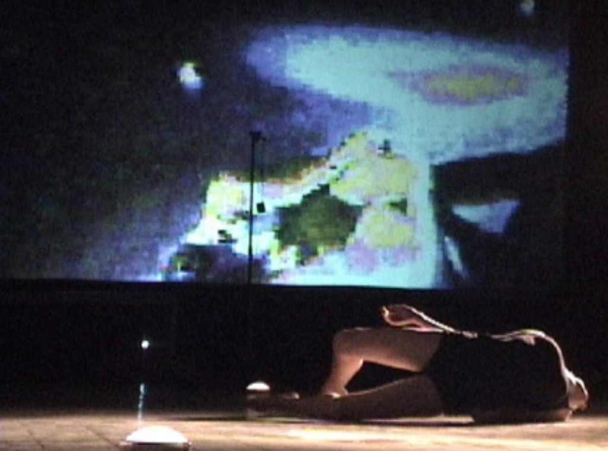

<!-- Edit this file, then run: node build-essays.js -->
<!-- Concept links: [coupling](concept:coupling) → network.html#coupling -->
<!-- Rebuild HTML + PDF: node build-essays.js --pdf -->

::: credit
*To the memory of Francisco Varela*

*First published in Johannes H. Birringer and Josephine Fenger (eds.), Tanz Im Kopf: Dance and Cognition (Broschiert), 2005.*
:::

This essay focuses on the theoretical and philosophical implications of hybrid improvisational performances. I propose to foreground some of the important characteristics of human cognitive processes and compositional design strategies and reframe them within the post-humanist approach in order to better understand improvisational composition with embodied physical actions and digital real-time multimedia. I introduce the post-humanist approach as an actualized paradigm for the understanding of improvisational dance coupled with digital multimedia. Post-humanism deals with the complexity of embodied cognitive processes that may happen within designed and digitally augmented contexts. It takes into account new theories of cognition and embodiment as well as biological models of intelligence, emergence and complexity theories.

The post-humanist approach helps me to recognize the illusory conceptual splits (mind-body, expression-experience, action-perception, observer-mover, body-world) in theorizations about improvisation and/or interactive dance practices. Since 1999, I have created improvisational performance with dancers under the name *Unstablelandscape* and, in the past three years, I’ve also incorporated real-time interactive digital technology into this process. These are not choreographies with multimedia, nor interactive environments in the traditional sense. Robb Lovell defines an interactive digital real-time environment as a digitally generated theatrical environment programmed to be influenced by the performers’ actions and to give image and sound feedback that is the resultant of algorithmic processes. In my pieces the dancers complete the feedback loop improvisationally. I conceive the landscapes as generative hybrid systems (humans and computers) that are set in motion in front of audiences/visitors that may or may not digitally interact with them.

My ideas and work have been influenced by more than twenty years of a very eclectic training and professional practice of dance in Venezuela and New York. Perhaps my background in psychology, my passion for science and the craft of real-time interactive design drove me to find a very fertile ground for theorization about my practices in specific fields of cognitive science and human-computer interaction such as the [embodied cognition](concept:4e) approach, biologically inspired models of intelligence, and theories of self-organization and emergence.

As improvisational performers we are trained to deploy our psycho-physical states in real time, composing our experience while attending simultaneously to both the dynamics of the process and the compositional outcome. Currently, my performances explore improvisational dance-theater where two dancers (Kristin Hapke and myself) generate and complete digital image/sound environments. Our performance environments are designed with Max/MSP/Jitter software for optic motion tracking, sensor driven interaction and deconstruction of the video and sound signals. I often use off-the-shelf game controllers as wireless wearable devices for the performers or as an interface for audience interaction. In my performances, the intelligence of the dance and the multimedia interaction is based on simple rules of interaction or algorithms (such as “if there is motion then…”, “change video when dancer moves”) as a way of generating communicative acts that are inherently changeable and unpredictable yet specific within computational parameters and metaphorical characteristics.

In *Unstablelandscape*, the dance and the multimedia system are not set for fixed choreography, but programmed for potential interactions between physical actions/interfaces within a network of behaviors and contingencies, in which real-time digital and embodied technologies (our training) generate compositional gestalts. The dancer is implicated in a continuous feedback loop of active awareness that includes his/her physical actions, the interfaces and the multimedia outputs. In other words, the dancers explore and modify a given landscape through the continuous [coupling](concept:coupling) with sensory and technically mediated stimuli, including sound, image projection, wearable sensors and tracking systems. In my work, the dancers and the programmed computational system couple in order to create a generative whole that will reflect compositional consistency. Two performances of the same landscape will be relatively different yet reflect the sameness as the landscape’s style space: its elements are both interrelated yet autonomous.

I propose that this multilayered and multi-causal dynamic craft which includes patterned human physical actions (dance-theater), computational systems and patterned outputs (image/sound), which can go from the most abstract patterns to the obvious representational depiction, must be understood as a design of a cognitive system in which cognition is the fundamental resource that allows the coupling. Therefore, human cognition is a process that is the raw material for composition that cuts across bodies and technological devices. It becomes obvious that cognition is embedded, embodied and [distributed](concept:distributed) within the system.

::: figure

Fig. 1: Marlon Barrios Solano, SPIFF/Unstablelandscape V — Kristin Hapke improvises a solo version at InteraktionsLabor Göttelborn, Germany (July, 2004). Audience members are able to change randomly the live video processing based on motion tracking using a wireless game controller. Wireless video cameras are mounted on glasses and on screen.
:::

## Dance as Cognition: Minds beyond Computational Models

Any embodied training implies a concept of mind (and body) and an ontology of movement as a system of causality, agency and control of body actions. Due to the nature of dance improvisation — composing on the spot with physical actions and changes in time and space — some dance improvisers developed approaches and training methods which fuse kinesthetic knowledge and perceptual and behavioral psychology. These naturalizations of the creative artistic process, in tandem with Eastern philosophies like Zen Buddhism and Aikido and artistic influences such as those of John Cage, Merce Cunningham and Mabel Todd among others, facilitated a model for human [embodiment](concept:embodiment), human actions in the world, and agency that allowed dance artists to deconstruct and dynamically re-conceive the notion of embodiment implied in their dance practices as non-fixed, flexible, plastic and therefore trainable.

I suspect that the advent of movement improvisation as an artistic dance practice in downtown New York in the 1960s and 1970s is closely related to the explanatory success of the communicational and information theory paradigms in science, particularly in the psychology of perception, biology and kinesiology. I agree with Scott deLahunta when he speculates that the focus in Robert Dunn’s very influential workshops in the 1960s, which focused on the use of chance, indeterminacy rules and constraints for the generation of choreographic structures, were perhaps influenced by the developments in computation and information theory. Therefore, it is possible that many present day dance practices belong to the same lineage as digital computers. In that sense computation became a model for algorithmic generative compositional strategies, but the main shift happened — I propose — in how improvisers conceived the ontology of movement within the continuum of mind, body and environment.

Many improvisation practitioners developed strategies for the phenomenological exploration of movement and training methods to increase their agency on their embodied movement experience to be executed as a performance or as a generative technique for choreographic creation. My point is that the influence of systems theory and its offspring such as [cybernetics](concept:cybernetics) and information theory, facilitated such a dynamic perspective of the body and mind, independently or embedded in theories of psychology of perception that were consciously or unconsciously appropriated and realized by the pioneers of contact improvisation and Body Mind Centering. Interestingly, most of these pioneers did their cross-disciplinary research beyond psychoanalytically inspired models of mind and classical behaviorism. They took references from scientific psychology or the studies of the mind in terms of the relation of cognitive processes and behavior.

[Dance](concept:dance) or moving became the interplay of psychological processes, all interrelated in an interactive whole that eliminated the top-down model of the mind as a separate entity from the body. This also helped to conceive of movement as beyond the hegemony of unconscious desires or a unique expressive goal. Some approaches to embodied training, in variable degrees, emphasized a naturalistic view of the communicational process experimenting with activities that conceived the experience of perception and action in many cases following the input-output unidirectional model: we perceive, then we act, perception lets information in and behaviour/movement comes out. These paradigmatic maneuvers enabled the improvisers to believe in the possibility of the cultivation of skills that willingly and dynamically control the body, and in the mind as an interactive agent on the body as its own system. Nevertheless, this important reformulation was based in communicational or machine control systems ideas (cybernetics). It did not include the importance of embodied motion that the practice of dance improvisation implied.

I believe that the investigation of improvisational movement brought into the picture a much more revolutionary psychological paradigm in which action-perception was conceived as a coupled inseparable whole abandoning the computational cybernetic model. Thus, we perceive as we move and we move in order to perceive. In this respect, I have found direct references to the ecological psychology of [James J. Gibson](concept:gibson) and his pioneering studies on visual perception in [Steve Paxton](concept:steve_paxton)’s and in Lisa Nelson’s writings. Nelson re-states the importance of Gibson’s ideas for the craft of improvisation, dance studies and its interface with cognitive science and philosophy of mind.

Gibson was principally concerned with visual perception, with how living creatures can see, recognize what they see, and act on it. He became frustrated with conventional approaches that separated seeing from acting, and regarded the two as being deeply connected. In contrast to conventional approaches within cognitive psychology, which tended to restrict the focus of mental processing to information defined by boundaries of the brain, Gibson was concerned with the organism living and acting in the world. For him, cognition was not purely a neural phenomenon; it was located within and throughout a complex involving the organism, the action and the environment. Interestingly, such ideas from ecological psychology have also made their way into recent research on human-computer interaction, robotics and virtual reality environments — including [affordances](concept:affordances) as what a situation allows, invites, or constrains for a particular organism or [assemblage](concept:assemblage).

## Embodied Plasticity

The embodied cognition approach is a new and growing challenge to traditional views of the mind. It rejects the assumption that the mind works like digital computers. In this approach knowing — categorizing the world, acting in it, giving meaning, and reflecting upon our acts — is essentially a non-propositional, fluid, messy, imaginative, personal, emergent, constructive, contextual and metaphorical process. Embodied cognition implies that consciousness and intelligence are not above the corporeal experience, but directly grounded in it. There is no separation of mind from body because there is no way in which the mental is abstracted from the material. All is process, all is emergent.

Consciousness, imagination, beliefs and desires are coequal with reasoning and language, and all are as much part and parcel of the human neural activity as is movement or perception. This expansive causal model of reciprocal relations between neural events and conscious activities brings a flexible and dynamic approximation to the complexity of composition with bodies and digital environments. Cognition and consciousness cut across brain-body-world divisions — the same [coupling](concept:coupling) [Hayles](concept:hayles), [Clark](concept:clark), and [Varela](concept:varela) would later name in different registers.

Based on ideas presented above and my experience as an improviser and interaction designer, I started to develop the concept of hyper-plasticity as a neuro-biological potential of our embodiment having the agency to self-modify and change using its own embodied processes, systemic organization and available technological couplings. This concept is mainly founded on the work of the neuroscientist V. S. Ramachandran, who asserts that the brain’s connections are extraordinary labile and dynamic. He suggests that our body image, despite all its appearance of durability and stability, is an entirely transitory, unstable, internal construction that can be profoundly modified with just a few simple tricks. He asserts that the human body’s space/time experience is dynamic, multiple, non-logical and mutable within functional boundaries neurologically and genetically determined.

Our embodiment has the potential to be modified and experienced as a mutable, composite and emergent phenomenon. It arises and is changed by the interaction of bodies within environments, constrained by the epistemological limits of our organic materiality. Our embodiment is more a dynamic than a fixed composition. I use the notion of hyper-plastic embodiment to denote a process in which human cognition, as an embodied process, instantiates and benefits from physical practices and technological interactions in order to recursively modify itself.

We distribute and off-load information processing on technological devices, tools and training methods changing our threshold of agency. In that sense, training methods and techniques enhance the potential for the creation of patterns of actions that are situated and couple with designed environments and technological/performative contexts. Generative techniques such as scores, rules of interaction, movement algorithms, chance operations, games, active imagination and metaphorical worlds will always depend on the cognitive processes that allow them to be executed in real time. When we improvise, we show an enhanced and cultivated agency on matching experiential awareness with actions in a continuous regulation of the performance within its specified or learned parameters. In my work, the programming of the digital environments, creation of the improvisational scores as metaphorical worlds, rules of interaction, sequence of actions, generative cognitive tools and the interface design are interacting parts of a recursive process of the design of a cognitive system.

## Designed Cognition: Post-humanist Performance

Improvisational dance practices are closer to a [posthuman](concept:posthumanism) paradigm than to dualist modernist views of the mind-body complex or a postmodernist disembodied textuality. The post-humanist perspective reconciles techno-scientific discourses, cultural representations of minds, bodies, dance and artificial systems with the processes that embody them, conceiving the body not as a receptacle of representations but as an active knower in which the biological and cultural conditions merge in a dynamic coupling. The post-humanist theorist N. Katherine Hayles proposes that changes in technology in these contexts or environments affect how people use their bodies and how space and time are experienced. For her, embodiment mediates between technology and discourse, creating new experiential frameworks that serve as markers for related discursive systems. For Hayles, the term post-human indicates the end of the humanist subject (not after human, as might be supposed), a subject who had the wealth, power and leisure to conceptualize itself as autonomous being exercising his/her will through individual agency and choice.

The theory of the post-human implies the recognition that as humans, we have never been in total control and that we have to relinquish fictions of total agency. The post-human is in itself a construction that is reflexive and physically grounded in its own material changes. In the post-humanist account, principles of emergence replace notions of teleology, objectivism is replaced by reflexive epistemology, autonomous will is replaced by distributed cognition, and the body as support of the mind is replaced by embodiment. In this way, the post-human becomes an epistemology that recognizes the dynamics of human bodies interacting within environments and semantic domains that co-create the characteristics of human experience in multiple feedback loops. Performance of improvisation and interactive media work are amplifiers of the dynamic characteristics of the human embodiment and the cultural context in which the body composes (experience/environment) as it moves. Within the post-humanist model, motion is just a part of a cognitive ecology of a system that includes actions, representations, hybrid devices and the creative possibilities of emergence. Our embodiment is what makes the environment interactive through cognitive strategies and technologies. We move the system of relations that we call body within another system of relations that we understand as its environment. Improvisational performances of any kind are always embodied: cultural, contextual and programmatic. They require the complex interplay of a relational ontology of systemic couplings and interactions.

## Phenomenology of the Coupling: Being-in-the-(Designed)-World

I now address the main schism in our understanding: we tend to separate our embodiment from the process of abstracting structural understanding and the experience of being in the world and the technologies of design and training that recursively affect our embodiment (being). Our cognition is neither a purely representational system of symbol manipulation nor an autonomous system of pure action and perception. Andy Clark points to a continuous reciprocal causation where what matters is not that all the elements of the system are cognitive systems themselves, but rather the nature of the causal couplings between components. These couplings provide a continuous and mutual modularity exchange making it fruitful to consider the emergent dynamics of the overarching system. In that sense, he continues, the brain, body and world can very often be joint participants in episodes of dense reciprocal causal influence — the [extended mind](concept:extended) and [natural-born cyborg](concept:cyborg) in practice before the names were commonplace.

## Real-time Composition

In order to design systemic contingencies, I program/train the probable coincidences in time and space of the observable perceptual unities (dancers’ behaviors and multimedia changes) that can have saliency for the users or observers of the system. Changes and patterns in these salient (and emergent) features of a multi-dimensional whole constitute the compositional organization, structure and trajectory in time.

I consider myself a designer of a cognitive relational control system, a system that changes and stays the same in a designed state of becoming within a predictable un-predictability. Real-time computational devices are serving as a constant reminder of the programmatic character of composition and of the possibility of finding freedom within constraints. We must broaden and shift our attention from the object of representation to the emergent organization, from the materialization of technology to the observable cognitive and behavioral dynamic flow within the designed system. We must consider the recursiveness of the process of design and its elements: human performers and designers, computers, interfaces (input/output systems), software, spatial architecture, training methods and — why not? — improvising robots. Performing within designed cognitive systems, our minds have evolved improvising, interacting and redesigning their own cognitive environments. It is a reminder that our embodiment emerges as a distributed relation of wholes and connections in a hybrid realm of augmented plasticity. As dancers and designers, with or without digital technologies, with or without robots, we now realize that we always have been post-human.

::: credit
I would like to thank Kristin Hapke for her fearless and intelligent dance, Karen Eliot for her encouragement and sharp intelligence, Emily Lawrence for her input in the writing of this essay, and the editors Johannes Birringer and Josephine Fenger for their trust in my work.
:::

## Bibliography

1. Birringer, Johannes H./Fenger, Josephine (eds.): *Tanz Im Kopf: Dance and Cognition* (Broschiert), 2005.
2. Bainbridge-Cohen, Bonnie: „Sensing, Feeling and Action: The Experiential Anatomy of Body-Mind Centering”, in: Don Hanlon Johnson (ed.): *Bone, Breath, and Gesture: Practices of Embodiment*, Berkeley 1995, pp. 185–203.
3. Brooks, Rodney A.: *Cambrian Intelligence: The Early History of the New AI*, Cambridge (MA) 1999.
4. Clark, Andy: *Being There: Putting Brain, Body and World Together Again*, Cambridge (MA) 1997.
5. Clark, Andy: *Natural-born Cyborgs: Minds, Technologies and the Future of Human Intelligence*, Oxford 2003.
6. deLahunta, Scott: “Periodic Convergences: Dance and Computers”, in: Dinkla, Söke/Leeker, Martina (eds.): *Tanz und Technologie/Dance and Technology*, Berlin 2003, pp. 66–87.
7. Dils, Ann/Cooper Albright, Ann (eds.): *Moving History/Dancing Cultures: a Dance History Reader*, Middletown (CT) 2001.
8. Dourish, Paul: *Where the Action Is: The Foundations of Embodied Interaction*, Cambridge, 2001.
9. Gibson, J. J.: *The perception of the visual world*, Boston 1950.
10. Gibson, J. J.: *The Senses Considered as Perceptual Systems*, Boston 1966.
11. Gibson, J. J.: *The ecological approach to visual perception*, Boston 1979.
12. Haugeland, John: *Having Thought: Essays in the Metaphysics of Mind*, Cambridge 1998.
13. Hayles, N. Katherine: *How we became Posthuman: Virtual Bodies in Cybernetics, Literature and Informatics*, Chicago 1999.
14. Hofstadter, Douglas: *Fluid Concepts and Creative Analogies: Computer Models of the Fundamental Mechanisms of Thought*, New York 1995.
15. Kelso, J. A. Scott: *Dynamic Patterns: The Self-Organization of Brain and Behavior*, Cambridge, 1999.
16. Lovell, Robb: “A Blueprint for Using an Interactive Performance Space”, in: Dinkla, Söke/Leeker, Martina (eds.): *Tanz und Technologie/Dance and Technology*, Berlin 2003, pp. 88–100.
17. Nelson, Lisa (ed.): “Mouvement et Perception”, *Vu du Corps – Nouvelles de Danse*, 48/49 2001, pp. 94–97.
18. Novack, Cynthia J.: *Sharing the Dance: Contact Improvisation and American Culture*, Madison 1990.
19. Paxton, Steve: “Improvisation Is a Word for Something That Can’t Keep a Name”, in: Ann Dils/Ann Cooper Albright (eds.): *Moving History/Dancing Cultures: a Dance History Reader*, Middletown (CT) 2001, pp. 421–426.
20. Ramachandran, V. S.: *Phantoms in the Brain: Probing the Mysteries of the Human Mind*, New York 1998.
21. Varela, Francisco/Thompson, Evan/Rosh, Eleanor: *The Embodied Mind: Cognitive Science and Human Experience*, Cambridge (MA) 1991.
22. Whitelaw, Mitchell: *Metacreation: Art and Artificial Life*, Cambridge 2004.

::: closing
*Originally developed through the Unstablelandscape performance series (1999–2005). First published in Johannes H. Birringer and Josephine Fenger (eds.), Tanz Im Kopf: Dance and Cognition (Broschiert), 2005. Republished in the Hybrid Intelligences Hub, September 3, 2026.*
:::
