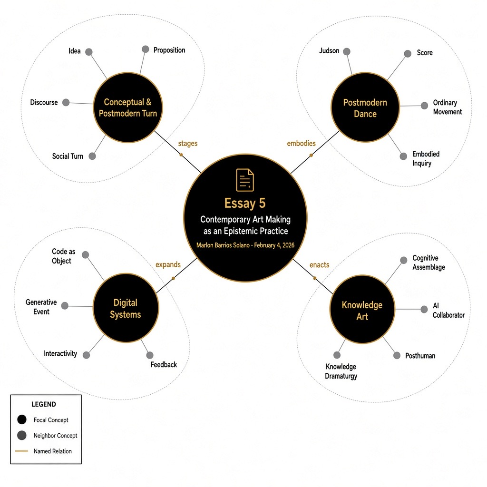

<!-- Edit this file, then run: node build-essays.js -->
<!-- Concept links: [coupling](concept:coupling) → network.html#coupling -->

::: figure

Essay 5 as practice · four clusters of contemporary art as an epistemic laboratory
:::

Contemporary art can no longer be understood merely as the production of aesthetic objects. It functions as a **mode of inquiry**, a field in which knowledge is generated, tested, destabilized, and reconfigured. In this sense, contemporary art is not only representational or expressive; it is epistemic. It produces ways of knowing. If [epistemology](concept:epistemology) concerns itself with how we know what we know, contemporary art often stages precisely this question — not as theory alone, but as embodied, material, relational practice.

The transformation of art into an epistemic practice can be traced to the conceptual and postmodern turns of the late twentieth century. Conceptual art displaced the primacy of the object and privileged the idea. The artwork was no longer simply a crafted artifact; it was an argument, a proposition, a system. Art became a vehicle for thought.

Simultaneously, postmodern thought destabilized grand narratives and universal claims to truth. Meaning was no longer assumed to be stable or authoritative; it was understood as produced through discourse, power, and representation. Artists began to interrogate not only images but the very systems that produce meaning. Art became reflexive — aware of its own conditions of production.

In this expanded field, art can be understood as a series of *epistemic engines* — experimental configurations that generate particular modes of knowing. Unlike scientific methodologies, which aim at stabilization and replication, artistic epistemologies often thrive on ambiguity, multiplicity, contradiction, and affect. They do not seek definitive answers but open fields of speculation.

## The Postmodern Turn in Dance and Choreography

The epistemic shift in contemporary art was paralleled — and profoundly embodied — in the postmodern turn in [dance](concept:dance) and [choreography](concept:choreography). Beginning in the 1960s with the Judson Dance Theater and related movements, choreography underwent a radical redefinition. Dance ceased to be primarily about virtuosic technique, narrative expression, or theatrical spectacle. Instead, it became an inquiry into movement itself.

Postmodern choreographers questioned:

- What counts as dance?
- Who can dance?
- What constitutes choreography?
- What is the relationship between movement, intention, and meaning?

Ordinary actions — walking, standing, falling — became choreographic material. Improvisation and task-based scores replaced fixed compositions. The body was no longer simply expressive; it was conceptual. Movement could function as a proposition, as a problem, as research.

This shift mirrored broader postmodern critiques of authorship and authority. Choreography became decentralized. The dancer could become a co-creator. Scores replaced scripts. Structures replaced narratives. Performance became event rather than representation.

Crucially, postmodern dance introduced [systems thinking](concept:systems_thinking) into choreography. Rules, constraints, chance operations, and procedural logics were used to generate movement. In doing so, choreography became algorithmic before the widespread use of digital computation. It modeled distributed decision-making and [embodied](concept:embodiment) [cognition](concept:cognition).

Dance, therefore, emerged as an epistemic practice in its own right. It investigated perception, gravity, relationality, time, and embodiment. It produced knowledge through the body.

## The Digital Turn and the Expansion of the Object

The advent of digital technologies intensified these epistemic transformations. Digital art disrupted traditional distinctions between artist and audience, object and process, creation and reception. Interactive and generative works cannot be fully understood as stable objects. They are dynamic systems that unfold through time and participation.

The digital “object” is no longer a singular material artifact; it may exist as code, as data, as algorithmic procedure, as networked relation. Each instantiation may differ. The artwork becomes an event, an interaction, a set of evolving conditions.

This transformation expands the ontology of the artwork. The disappearance of the fixed object signals a shift toward distributed and temporal forms of existence. The artwork may reside in computation, in interface, in audience participation, or in evolving datasets. Knowledge is not embedded in a static form but emerges relationally.

Interactivity and generativity introduce new epistemic dynamics. Interactive systems require participant agency. Generative systems introduce indeterminacy and procedural emergence. These systems model complexity, contingency, feedback — epistemological conditions aligned with [cybernetics](concept:cybernetics) and systems theory. Knowledge is [enacted](concept:enacted) rather than merely represented.

The digital turn, therefore, extends the postmodern expansion of choreography and conceptual art. It radicalizes the shift from object to system.

## Cognition, Generativity, and Posthuman Frameworks

Contemporary digital art increasingly incorporates cognitive processes as material. Artists design systems in which [machine learning](concept:machine_learning) models, [neural networks](concept:neural_networks), and algorithmic agents participate in meaning-making. Cognition becomes distributed across human and nonhuman [assemblages](concept:assemblage).

This shift aligns with [posthuman](concept:posthumanism) thought, which challenges binaries such as:

- Natural / Artificial
- Organic / Technological
- Human / Machine
- Culture / Nature

The use of [AI](concept:ai) in art destabilizes assumptions about authorship, [creativity](concept:creativity), and intelligence. If generative systems can produce images, texts, movement proposals, and decisions, what becomes of the human artist? Rather than replacing human creativity, many artists treat AI as collaborator, interlocutor, or epistemic partner.

In this posthuman framework, art becomes a site where cognitive assemblages are staged and explored. It is no longer simply about representing the world but about probing how intelligence — human and machinic — constructs the world.

## My Practice as Knowledge Art

Within this broader field, I understand my own practice as operating explicitly as an epistemic system.

Coming from dance and choreography, I was shaped by the postmodern expansion of movement into conceptual territory. Improvisation, task-based composition, and systems thinking were already forms of embodied research for me. Choreography was never simply about producing movement; it was about investigating perception, relationality, and distributed decision-making.

When I began integrating digital technologies and [generative AI](concept:gen_ai) into my work, I did not experience this as a rupture but as a continuation. Algorithmic systems extend choreographic logic. Code becomes a score. A neural network becomes a partner in improvisation. A generative model becomes a procedural dramaturg.

My work integrates machine learning, generative AI, embodied performance, and contemplative practices to develop what I call *knowledge dramaturgies* — experimental frameworks where identity, memory, and cognition are remixed and reconfigured.

I do not use AI as a neutral tool. I approach generative systems as speculative collaborators. Their outputs — often unstable, hallucinatory, or glitched — function as provocations rather than solutions. They are epistemic fictions. They produce conditions for reflection.

In my performance-lectures and interactive installations, I construct cognitive assemblages where code, language, movement, and audience participation co-produce meaning. The performance space becomes a laboratory of distributed cognition. The audience is not positioned as passive spectators but as co-investigators. Knowledge is staged as unstable, performative, and playful.

I frequently adopt game structures and procedural scripts as epistemological tools. These structures allow multiple perspectives to coexist. Rather than presenting conclusions, I design systems in which contradictions unfold over time. Thought itself becomes choreographed.

My practice also operates within diasporic and decolonial frameworks. I use AI to question dominant epistemologies and to foreground alternative narratives and epistemic traditions. By publishing my works under open-source licenses, I treat artistic production as epistemic sharing — knowledge as commons rather than commodity.

Crucially, I situate my work within a posthuman paradigm. I am interested in distributed cognition and machine imagination as zones of creative potential. I do not see artificial systems as external to embodiment; they are part of our [cognitive ecology](concept:ecology). The boundary between natural and artificial is not stable. It is constructed, negotiated, performed.

In this way, my work inhabits the edge between conceptual art, choreography, and [artificial intelligence](concept:ai). Conceptuality becomes computational. Choreography becomes systemic. AI becomes dramaturgical.

If contemporary art can be understood as a systemic epistemic practice, then I can indeed describe my work as *knowledge art* — art that does not merely represent knowledge but stages its production.

## Conclusion: Art as Epistemic Laboratory

The conceptual and postmodern turns displaced the object in favor of inquiry. Postmodern dance transformed choreography into embodied research. The digital turn expanded the artwork into processes, systems, and events. Interactivity and generativity introduced new epistemic conditions rooted in participation and emergence.

Contemporary art today operates as an epistemic laboratory. It experiments with the structures of knowing themselves. It stages encounters between bodies, codes, narratives, and systems. It interrogates how intelligence — human and machinic — organizes reality.

In the age of AI and networked computation, this epistemic dimension becomes urgent. Art offers a space to question how cognition is distributed, how narratives are constructed, and how binaries such as natural/artificial or human/machine are maintained or dissolved.

Art is no longer simply about representation. It is about experimenting with the conditions of knowledge itself. In this expanded field, choreography, conceptuality, digital systems, and posthuman inquiry converge. Contemporary art becomes not a mirror of the world but a dynamic practice of knowing the world differently.
